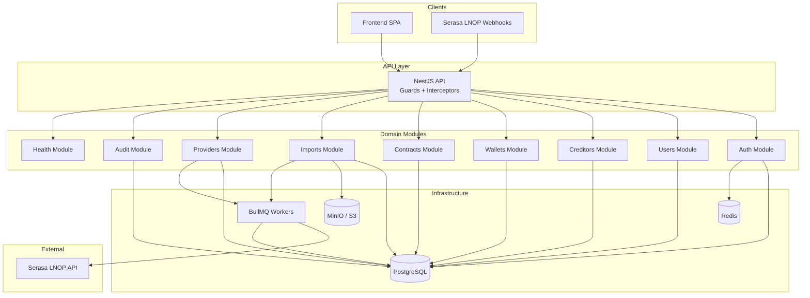
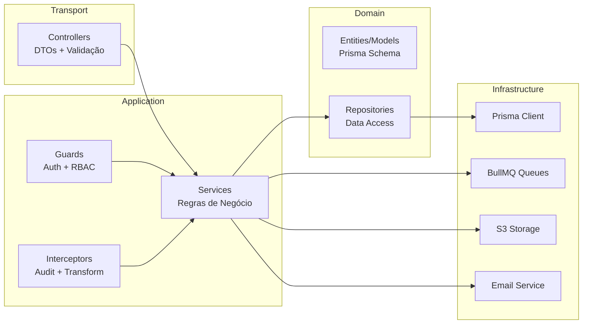
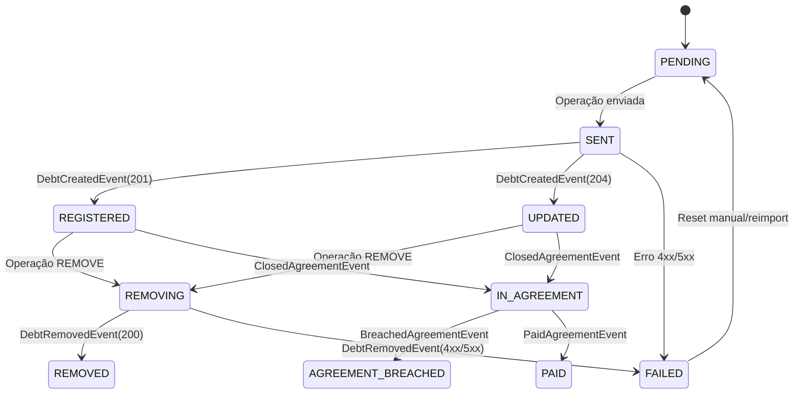
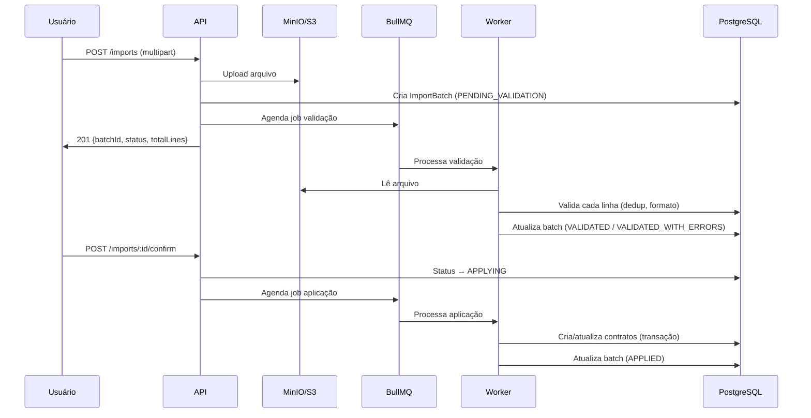
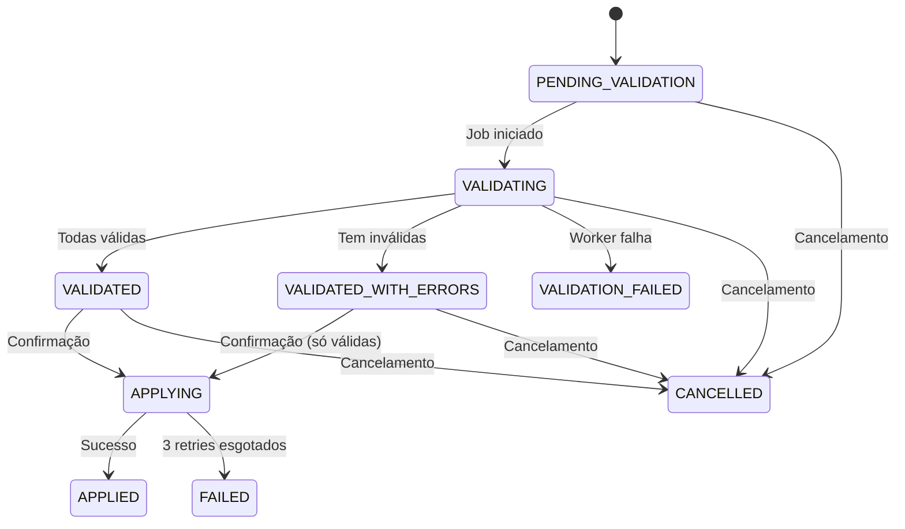
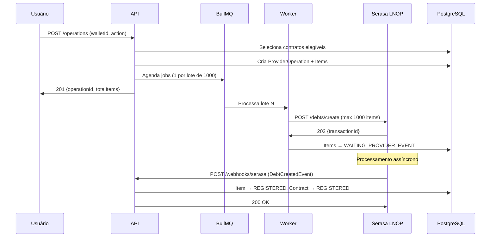

# Design Técnico — CobData Backend MVP

## Overview

O CobData Backend MVP é uma API REST construída com NestJS + TypeScript estrito, seguindo arquitetura modular por domínio. O sistema gerencia o ciclo de vida completo de contratos de dívida: desde a autenticação de usuários com RBAC granular, passando pela importação em massa via CSV/XLSX, até a integração com o provedor Serasa Limpa Nome Parceiros (LNOP) para negativação e remoção de débitos.

### Decisões Arquiteturais Chave

1. **Modular por domínio** — Cada domínio de negócio é um NestJS Module isolado com seus controllers, services, e repositórios.
2. **Prisma como ORM** — Schema declarativo, migrations versionadas, type-safety completo.
3. **BullMQ para jobs assíncronos** — Validação de imports, aplicação de batches e envio a provedores.
4. **Abstração de provedor** — Interface genérica `ProviderAdapter` permite trocar/adicionar provedores sem alterar lógica de negócio.
5. **Single-tenant com Account** — O modelo mantém `accountId` em todas as entidades para future-proofing multi-tenant.
6. **Refresh Token Rotation** — Família de tokens com detecção de reuso para segurança de sessão.

---

## Architecture

### Diagrama de Alto Nível



### Diagrama de Camadas



### Estrutura de Diretórios

```
src/
├── main.ts
├── app.module.ts
├── common/
│   ├── decorators/          # @Roles, @CurrentUser, @Public
│   ├── guards/              # JwtAuthGuard, RolesGuard, ScopeGuard
│   ├── interceptors/        # AuditInterceptor, TransformInterceptor
│   ├── filters/             # GlobalExceptionFilter
│   ├── pipes/               # ValidationPipe config
│   ├── dto/                 # PaginationDto, base DTOs
│   └── interfaces/          # Shared interfaces
├── config/                  # ConfigModule schemas (Zod)
├── prisma/
│   ├── prisma.module.ts
│   ├── prisma.service.ts
│   └── schema.prisma
├── auth/
│   ├── auth.module.ts
│   ├── auth.controller.ts
│   ├── auth.service.ts
│   ├── strategies/          # JwtStrategy, LocalStrategy
│   ├── dto/
│   └── guards/
├── users/
│   ├── users.module.ts
│   ├── users.controller.ts
│   ├── users.service.ts
│   └── dto/
├── creditors/
├── wallets/
├── contracts/
│   ├── contracts.module.ts
│   ├── contracts.controller.ts
│   ├── contracts.service.ts
│   ├── deduplication.service.ts
│   ├── tags.controller.ts
│   ├── tags.service.ts
│   └── dto/
├── imports/
│   ├── imports.module.ts
│   ├── imports.controller.ts
│   ├── imports.service.ts
│   ├── processors/
│   │   ├── validation.processor.ts
│   │   └── application.processor.ts
│   └── dto/
├── providers/
│   ├── providers.module.ts
│   ├── providers.controller.ts
│   ├── providers.service.ts
│   ├── operations.controller.ts
│   ├── operations.service.ts
│   ├── webhooks.controller.ts
│   ├── webhooks.service.ts
│   ├── adapters/
│   │   ├── provider-adapter.interface.ts
│   │   └── serasa-lnop.adapter.ts
│   └── dto/
├── audit/
│   ├── audit.module.ts
│   ├── audit.service.ts
│   ├── audit.controller.ts
│   └── audit.interceptor.ts
└── health/
    ├── health.module.ts
    └── health.controller.ts
```

---

## Components and Interfaces

### 1. Auth Module

Responsável por login, refresh, logout, sessões, convites, troca e recuperação de senha.

**Componentes:**
- `AuthController` — Endpoints: login, refresh, logout, me, activate, change-password, forgot-password, reset-password, sessions
- `AuthService` — Lógica de autenticação, geração de tokens, rate limiting
- `JwtStrategy` — Validação do AccessToken via Passport
- `TokenService` — Emissão e rotação de AccessToken/RefreshToken
- `SessionService` — Gestão de sessões ativas (CRUD, invalidação)
  - **Revoke single** (`DELETE /auth/sessions/:sessionId`): invalida a sessão especificada. Se o `sessionId` corresponde à sessão corrente do usuário (extraída do JWT), rejeita com HTTP 409 indicando que a sessão corrente não pode ser encerrada por este endpoint — use `POST /auth/logout` em vez disso (Req 6.3).
- `PasswordService` — Hash Argon2id, validação de complexidade

**Interfaces:**

```typescript
interface JwtPayload {
  sub: string;        // userId (UUID)
  accountId: string;  // Account UUID
  role: Role;         // ADMIN | OPERATIONAL | VIEWER
  sessionId: string;  // Session UUID
  iat: number;
  exp: number;
}

interface TokenPair {
  accessToken: string;
  refreshToken: string;
}

interface SessionInfo {
  id: string;
  userAgent: string;
  ipAddress: string;
  createdAt: Date;
  isCurrent: boolean;
}
```

**Rate Limiting (Login):**
- Armazenado no Redis com chave `login:attempts:{email}`
- TTL de 15 minutos na janela
- Contador incrementado a cada falha
- Bloqueio após 5 falhas: retorna HTTP 429 com `retryAfterSeconds`

### 2. Users Module

Gestão de usuários, convites e ativação.

**Componentes:**
- `UsersController` — CRUD de usuários, invite, resend-invite, force-reset
- `UsersService` — Lógica de negócio de usuários
  > **Proteção de último ADMIN (Req 4.10):** Antes de aplicar um `PATCH /users/:id` que desativa (`isActive = false`) ou rebaixa o role de um usuário ADMIN, o service deve verificar se esse é o último ADMIN ativo no sistema (query: `COUNT(*) WHERE role = ADMIN AND isActive = true AND id != targetId`). Se o resultado for 0, rejeitar com HTTP 409 — "O sistema deve manter ao menos um ADMIN ativo."
- `InviteService` — Geração de tokens de convite, envio de e-mail

**Interfaces:**

```typescript
interface CreateInviteDto {
  email: string;
  role: Role;
  scopes?: string[];  // walletIds para VIEWER
}

interface ActivateDto {
  token: string;
  password: string;  // min 8, uppercase, lowercase, digit
}

enum UserStatus {
  PENDING = 'PENDING',
  ACTIVE = 'ACTIVE',
  INACTIVE = 'INACTIVE',
}
```

### 3. RBAC System (Guards)

Implementado como Guard chain no NestJS.

```typescript
// Decorators
@Roles(Role.ADMIN)
@Roles(Role.ADMIN, Role.OPERATIONAL)

// Guards (aplicados globalmente via APP_GUARD)
@Injectable()
export class JwtAuthGuard extends AuthGuard('jwt') {}

@Injectable()
export class RolesGuard implements CanActivate {
  // Verifica se user.role está na lista de roles permitidas
}

@Injectable()
export class ScopeGuard implements CanActivate {
  // Para VIEWER: verifica se walletId está nos scopes do usuário
  // Para ADMIN/OPERATIONAL: permite tudo
}
```

**Lógica de Scope Filtering:**
- VIEWER → filtra queries adicionando `WHERE walletId IN (userScopes)`
- OPERATIONAL → acesso a todas as wallets, sem escrita em configuração de providers ou users
- ADMIN → acesso total

### 4. Creditors Module

```typescript
interface CreateCreditorDto {
  name: string;          // 1-255 chars
  cnpj?: string;         // 14 dígitos, dígito verificador válido
  contacts?: Contact[];  // max 10 entries
  address?: Address;
}

interface Contact {
  type: 'EMAIL' | 'PHONE' | 'WHATSAPP';
  value: string;
}

interface Address {
  street?: string;
  number?: string;
  complement?: string;
  neighborhood?: string;
  city?: string;
  state?: string;       // UF (2 chars)
  zipCode?: string;     // CEP (8 dígitos)
}
```

### 5. Wallets Module

```typescript
interface CreateWalletDto {
  name: string;  // 1-120 chars após trim
}

interface WalletDetailResponse {
  id: string;
  name: string;
  status: 'ACTIVE' | 'INACTIVE';
  creditorId: string;
  summary: {
    totalContracts: number;
    contractsByStatus: Record<ProviderStatus, number>;
    totalValue: number;
  };
}
```

### 6. Contracts Module

**Componentes:**
- `ContractsController` — CRUD, listagem paginada com filtros
- `ContractsService` — Lógica de negócio, validação
- `DeduplicationService` — Cálculo e verificação de DeduplicationKey
- `TagsController` — Endpoints de tags
- `TagsService` — Normalização e gestão de tags

**DeduplicationKey:**

```typescript
// Composição: SHA-256 hash de campos concatenados
// NOTA: O endpoint de API recebe walletId. O creditorId é resolvido via
// wallet.creditorId (lookup na Wallet associada) antes de computar a chave.
function computeDeduplicationKey(data: {
  creditorId: string;  // Resolvido de wallet.creditorId, não recebido diretamente
  debtorDocument: string;
  contractNumber: string;
  debtOriginDocument?: string;
}): string {
  const input = [
    data.creditorId,
    sha256(data.debtorDocument),
    data.contractNumber,
    data.debtOriginDocument ? sha256(data.debtOriginDocument) : '',
  ].join('|');
  return sha256(input);
}
```

**Provider Status Machine:**



### 7. Imports Module

**Componentes:**
- `ImportsController` — Upload, consulta, confirmação, cancelamento
- `ImportsService` — Criação de batch, agendamento de jobs
- `ValidationProcessor` — Worker BullMQ para validação de linhas
  > **Cancelamento gracioso (Req 14.8):** O worker deve verificar periodicamente (a cada N linhas processadas, ex: a cada 500 linhas) o status do batch no banco. Se detectar `status = CANCELLED`, o worker deve abortar o processamento imediatamente, preservar os resultados parciais já computados e encerrar o job sem erro.
- `ApplicationProcessor` — Worker BullMQ para aplicação de contratos

**Fluxo de Importação:**



**Import Batch Status Machine:**



### 8. Providers Module

**Componentes:**
- `ProvidersController` — Configuração de provedores
- `ProvidersService` — CRUD de configuração, wallet mapping
- `OperationsController` — Criação e consulta de operações
- `OperationsService` — Seleção de contratos, criação de lotes
  > **Critérios de elegibilidade para seleção de contratos (Req 17.1):** Ao criar uma operação, a query de seleção de contratos elegíveis DEVE incluir as condições: `walletId = :walletId AND providerStatus = 'PENDING' AND status = 'ACTIVE' AND deletedAt IS NULL`. Contratos com soft-delete (`deletedAt` preenchido) são excluídos de qualquer operação de provedor.
- `WebhooksController` — Recebimento de webhooks (sem auth JWT)
- `WebhooksService` — Validação de assinatura, processamento de eventos
- `SerasaLnopAdapter` — Implementação concreta do adapter

**Interface do Adapter:**

```typescript
interface ProviderAdapter {
  readonly type: ProviderType;

  sendDebts(items: DebtPayload[], config: ProviderConfig): Promise<SendResult>;
  removeDebts(items: RemovePayload[], config: ProviderConfig): Promise<SendResult>;
  validateWebhookSignature(
    headers: Record<string, string>,
    body: Buffer,
    secret: string,
  ): boolean;
}

interface SendResult {
  httpStatus: number;
  transactionId?: string;
  items?: Array<{ externalId?: string; debtId?: string }>;
  error?: { code: string; message: string };
}

interface DebtPayload {
  operationItemId: string;
  debtorDocument: string;
  contractNumber: string;
  debtType: DebtType;
  occurrenceDate: string;
  originalValue: number;
  updatedValue?: number;
  debtOrigin?: string;
}

interface RemovePayload {
  operationItemId: string;
  debtId: string;          // ID previamente armazenado do Serasa
  debtorDocument: string;
  contractNumber: string;
}

interface ProviderConfig {
  apiKey: string;
  baseUrl: string;
  environment: 'HOMOLOGATION' | 'PRODUCTION';
  walletMappings: Map<string, string>;  // localWalletId → externalWalletId
}
```

**Fluxo de Operação de Provedor:**



> **Roteamento de Webhooks:** Os endpoints de webhook ficam fora do prefixo global `/api` para evitar conflito com autenticação JWT. O endpoint final é `POST /webhooks/serasa` (sem `/api`), configurado via route prefix exclusivo no controller. O `WebhooksController` usa o decorator `@Public()` para pular o JwtAuthGuard e valida autenticidade via assinatura HMAC do provedor.

### 9. Audit Module

**Componentes:**
- `AuditService` — Persiste entradas de auditoria (best-effort)
- `AuditInterceptor` — Captura automaticamente ações em controllers
- `AuditController` — Consulta de logs (somente ADMIN)

```typescript
interface AuditEntry {
  id: string;
  action: AuditAction;
  userId: string;
  resourceType: string;
  resourceId: string;
  timestamp: string;     // ISO 8601
  requestId: string;     // UUID v4
  operationId?: string;  // Para operações de provedor
  jobId?: string;        // Para jobs BullMQ
  metadata?: object;     // Max 4KB, sem dados pessoais
}

// AuditAction é um tipo string literal union (não é enum Prisma).
// O campo `action` no AuditLog é armazenado como String no banco.
type AuditAction =
  | 'AUTH_LOGIN_SUCCESS'
  | 'AUTH_LOGIN_FAILED'
  | 'AUTH_LOGOUT'
  | 'AUTH_REFRESH'
  | 'AUTH_PASSWORD_CHANGE'
  | 'AUTH_PASSWORD_RESET'
  | 'AUTH_FORCE_RESET'
  | 'AUTH_RATE_LIMIT_TRIGGERED'
  | 'USER_INVITE'
  | 'USER_ACTIVATE'
  | 'USER_UPDATE'
  | 'USER_DEACTIVATE'
  | 'CREDITOR_CREATE'
  | 'CREDITOR_UPDATE'
  | 'CREDITOR_DELETE'
  | 'WALLET_CREATE'
  | 'WALLET_UPDATE'
  | 'WALLET_DELETE'
  | 'CONTRACT_CREATE'
  | 'CONTRACT_UPDATE'
  | 'CONTRACT_DELETE'
  | 'CONTRACT_TAG_ADD'
  | 'CONTRACT_TAG_REMOVE'
  | 'IMPORT_UPLOAD'
  | 'IMPORT_CONFIRM'
  | 'IMPORT_CANCEL'
  | 'PROVIDER_CONFIG_CREATE'
  | 'PROVIDER_CONFIG_UPDATE'
  | 'PROVIDER_WALLET_MAP'
  | 'OPERATION_CREATE'
  | 'OPERATION_CANCEL'
  | 'WEBHOOK_RECEIVED'
  | 'WEBHOOK_PROCESSED';
```

### 10. Health Module

- `GET /health/live` — Liveness: responde 200 com nome, versão e uptime. Sem auth. < 100ms.
- `GET /health/ready` — Readiness: verifica PostgreSQL, Redis e filas BullMQ. Timeout de 3s por dependência, 5s total.

---

## Data Models

### Prisma Schema (Resumo)

```prisma
// ============ CORE ============

model Account {
  id        String   @id @default(uuid())
  name      String
  createdAt DateTime @default(now())
  updatedAt DateTime @updatedAt

  users              User[]
  creditors          Creditor[]
  wallets            Wallet[]
  contracts          Contract[]
  providers          Provider[]
  importBatches      ImportBatch[]
  providerOperations ProviderOperation[]
}

model User {
  id                 String     @id @default(uuid())
  accountId          String
  email              String     @unique
  passwordHash       String?
  name               String?
  role               Role
  isActive           Boolean    @default(false)
  mustResetPassword  Boolean    @default(false)
  twoFactorSecret    String?
  twoFactorEnabled   Boolean    @default(false)
  createdAt          DateTime   @default(now())
  updatedAt          DateTime   @updatedAt

  account            Account            @relation(fields: [accountId], references: [id])
  scopes             UserScope[]
  sessions           Session[]
  invites            Invite[]
  auditLogs          AuditLog[]
  providerOperations ProviderOperation[]
}

model UserScope {
  id       String @id @default(uuid())
  userId   String
  walletId String

  user   User   @relation(fields: [userId], references: [id])
  wallet Wallet @relation(fields: [walletId], references: [id])

  @@unique([userId, walletId])
}

model Session {
  id             String   @id @default(uuid())
  userId         String
  tokenFamily    String   @unique @default(uuid())
  refreshTokenHash String
  userAgent      String?
  ipAddress      String?
  isRevoked      Boolean  @default(false)
  createdAt      DateTime @default(now())
  expiresAt      DateTime
  lastUsedAt     DateTime @default(now())

  user User @relation(fields: [userId], references: [id])
}

model Invite {
  id        String       @id @default(uuid())
  userId    String
  token     String       @unique
  role      Role
  scopes    Json?        // walletIds array definido pelo ADMIN no momento do convite
  status    InviteStatus @default(PENDING)
  expiresAt DateTime
  createdAt DateTime     @default(now())

  user User @relation(fields: [userId], references: [id])
}

// ============ BUSINESS ============

model Creditor {
  id        String    @id @default(uuid())
  accountId String
  name      String
  cnpj      String?   @unique
  contacts  Json?     // Contact[]
  address   Json?
  deletedAt DateTime?
  createdAt DateTime  @default(now())
  updatedAt DateTime  @updatedAt

  account Account  @relation(fields: [accountId], references: [id])
  wallets Wallet[]
}

model Wallet {
  id         String       @id @default(uuid())
  accountId  String
  creditorId String
  name       String
  status     WalletStatus @default(ACTIVE)
  deletedAt  DateTime?
  createdAt  DateTime     @default(now())
  updatedAt  DateTime     @updatedAt

  account            Account            @relation(fields: [accountId], references: [id])
  creditor           Creditor           @relation(fields: [creditorId], references: [id])
  contracts          Contract[]
  importBatches      ImportBatch[]
  userScopes         UserScope[]
  walletMappings     WalletMapping[]
  providerOperations ProviderOperation[]
}

model Contract {
  id                 String         @id @default(uuid())
  accountId          String
  walletId           String
  debtorDocument     String         // CPF/CNPJ criptografado
  debtorDocumentHash String         // SHA-256 para busca
  contractNumber     String
  debtType           DebtType
  occurrenceDate     DateTime
  originalValue      Decimal        @db.Decimal(15, 2)
  updatedValue       Decimal?       @db.Decimal(15, 2)
  debtOrigin         String?
  debtOriginDocHash  String?        // SHA-256
  offer              Json?          // Oferta pré-calculada (opcional, Req 11.2)
  deduplicationKey   String         @unique
  providerStatus     ProviderStatus @default(PENDING)
  status             ContractStatus @default(ACTIVE)
  debtId             String?        // ID retornado pelo Serasa
  paidInstallments   Int            @default(0)
  deletedAt          DateTime?
  createdAt          DateTime       @default(now())
  updatedAt          DateTime       @updatedAt

  account        Account                 @relation(fields: [accountId], references: [id])
  wallet         Wallet                  @relation(fields: [walletId], references: [id])
  tags           ContractTag[]
  operationItems ProviderOperationItem[]

  @@index([walletId, providerStatus])
  @@index([walletId, status, deletedAt])
  @@index([debtorDocumentHash])
  @@index([deduplicationKey])
}

model ContractTag {
  id         String @id @default(uuid())
  contractId String
  tag        String // normalizado lowercase + trim

  contract Contract @relation(fields: [contractId], references: [id])

  @@unique([contractId, tag])
  @@index([tag])
}

// ============ IMPORTS ============

model ImportBatch {
  id              String            @id @default(uuid())
  accountId       String
  walletId        String
  userId          String
  fileName        String
  fileUrl         String            // S3 key
  columnMapping   Json
  totalLines      Int
  validLines      Int               @default(0)
  invalidLines    Int               @default(0)
  createdCount    Int               @default(0)
  updatedCount    Int               @default(0)
  ignoredCount    Int               @default(0)
  status          ImportBatchStatus @default(PENDING_VALIDATION)
  createdAt       DateTime          @default(now())
  updatedAt       DateTime          @updatedAt

  account Account          @relation(fields: [accountId], references: [id])
  wallet  Wallet           @relation(fields: [walletId], references: [id])
  errors  ImportBatchError[]
}

model ImportBatchError {
  id          String @id @default(uuid())
  batchId     String
  lineNumber  Int
  errorCode   String
  fieldName   String
  message     String
  fieldValue  String? // mascarado (últimos 4 chars para dados pessoais)

  batch ImportBatch @relation(fields: [batchId], references: [id])

  @@index([batchId])
}

// ============ PROVIDERS ============

model Provider {
  id            String       @id @default(uuid())
  accountId     String
  type          ProviderType @unique
  environment   ProviderEnv
  credentials   String       // Criptografado em repouso (AES-256-GCM)
  createdAt     DateTime     @default(now())
  updatedAt     DateTime     @updatedAt

  account        Account         @relation(fields: [accountId], references: [id])
  walletMappings WalletMapping[]
  operations     ProviderOperation[]
  webhookEvents  WebhookEvent[]
}

model WalletMapping {
  id               String @id @default(uuid())
  providerId       String
  walletId         String
  externalWalletId String

  provider Provider @relation(fields: [providerId], references: [id])
  wallet   Wallet   @relation(fields: [walletId], references: [id])

  @@unique([providerId, walletId])
}

model ProviderOperation {
  id         String          @id @default(uuid())
  accountId  String
  providerId String
  walletId   String
  userId     String
  action     OperationAction
  status     OperationStatus @default(PENDING)
  totalItems Int
  createdAt  DateTime        @default(now())
  updatedAt  DateTime        @updatedAt

  account  Account                 @relation(fields: [accountId], references: [id])
  provider Provider                @relation(fields: [providerId], references: [id])
  wallet   Wallet                  @relation(fields: [walletId], references: [id])
  user     User                    @relation(fields: [userId], references: [id])
  items    ProviderOperationItem[]
}

model ProviderOperationItem {
  id            String              @id @default(uuid())
  operationId   String
  contractId    String
  batchIndex    Int                 // índice do lote (0..N)
  status        OperationItemStatus @default(PENDING)
  transactionId String?
  debtId        String?
  errorCode     String?
  errorMessage  String?
  attempts      Int                 @default(0)
  lastAttemptAt DateTime?
  createdAt     DateTime            @default(now())
  updatedAt     DateTime            @updatedAt

  operation ProviderOperation @relation(fields: [operationId], references: [id])
  contract  Contract          @relation(fields: [contractId], references: [id])

  @@index([operationId, batchIndex])
  @@index([transactionId])
}

model WebhookEvent {
  id            String        @id @default(uuid())
  providerId    String
  eventType     String
  transactionId String?
  payload       Json
  status        WebhookStatus @default(RECEIVED)
  processedAt   DateTime?
  createdAt     DateTime      @default(now())

  provider Provider @relation(fields: [providerId], references: [id])

  @@unique([transactionId, eventType])
  @@index([transactionId])
}

// ============ AUDIT ============

model AuditLog {
  id           String   @id @default(uuid())
  action       String
  userId       String?
  resourceType String?
  resourceId   String?
  requestId    String
  operationId  String?
  jobId        String?
  ipAddress    String?
  metadata     Json?    // Max 4KB
  createdAt    DateTime @default(now())

  user User? @relation(fields: [userId], references: [id])

  @@index([action, createdAt])
  @@index([userId, createdAt])
  @@index([resourceType, resourceId])
  @@index([requestId])
}
```

### Enums

```prisma
enum Role {
  ADMIN
  OPERATIONAL
  VIEWER
}

enum InviteStatus {
  PENDING
  ACCEPTED
  EXPIRED
}

enum WalletStatus {
  ACTIVE
  INACTIVE
}

enum DebtType {
  COMMERCIAL
  BANKING
  SERVICES
  UTILITIES
  TELECOM
  EDUCATION
  HEALTH
  CONDOMINIAL
  OTHER
}

enum ProviderStatus {
  PENDING
  SENT
  REGISTERED
  UPDATED
  FAILED
  REMOVING
  REMOVED
  IN_AGREEMENT
  AGREEMENT_BREACHED
  PAID
}

enum ContractStatus {
  ACTIVE
  SUSPENDED
  CANCELLED
}

enum ImportBatchStatus {
  PENDING_VALIDATION
  VALIDATING
  VALIDATED
  VALIDATED_WITH_ERRORS
  VALIDATION_FAILED
  APPLYING
  APPLIED
  FAILED
  CANCELLED
}

enum ProviderType {
  SERASA_LNOP
}

enum ProviderEnv {
  HOMOLOGATION
  PRODUCTION
}

enum OperationAction {
  CREATE_OR_UPDATE
  REMOVE
}

enum OperationStatus {
  PENDING
  PROCESSING
  COMPLETED
  PARTIALLY_FAILED
  FAILED
  CANCELLED
}

enum OperationItemStatus {
  PENDING
  WAITING_PROVIDER_EVENT
  REGISTERED
  UPDATED
  REMOVED
  FAILED
}

enum WebhookStatus {
  RECEIVED
  PROCESSED
  UNMATCHED
  DUPLICATE
}
```

### Índices e Performance

| Tabela | Índice | Justificativa |
|--------|--------|---------------|
| Contract | `(walletId, providerStatus)` | Seleção de contratos elegíveis para operações |
| Contract | `(walletId, status, deletedAt)` | Queries multi-tenant filtradas por wallet e status |
| Contract | `(debtorDocumentHash)` | Busca por documento do devedor |
| Contract | `(deduplicationKey)` UNIQUE | Deduplicação rápida |
| ContractTag | `(tag)` | Filtro por tag na listagem |
| ProviderOperationItem | `(transactionId)` | Correlação com webhooks |
| AuditLog | `(action, createdAt)` | Consulta de logs por tipo/período |
| AuditLog | `(requestId)` | Rastreamento de requisição |

---

## Correctness Properties

*A property is a characteristic or behavior that should hold true across all valid executions of a system — essentially, a formal statement about what the system should do. Properties serve as the bridge between human-readable specifications and machine-verifiable correctness guarantees.*

### Property 1: JWT Structure Invariant

*For any* issued AccessToken JWT, the decoded payload SHALL contain exactly the fields `sub`, `accountId`, `role`, `sessionId`, `iat`, and `exp` — with `exp` set to 15 minutes after `iat` — and no additional fields (no name, email, phone, document, or permission data).

**Validates: Requirements 3.2, 1.1, 7.2**

### Property 2: Invalid Credentials Produce Uniform Response

*For any* login attempt with incorrect email, incorrect password, or inactive user status, the API SHALL return HTTP 401 with an identical generic error message structure, making it impossible to distinguish which credential component failed.

**Validates: Requirements 1.2, 1.3**

### Property 3: Rate Limiting Blocks After Threshold

*For any* email address, after exactly 5 consecutive failed login attempts within a 15-minute window, the next login attempt SHALL return HTTP 429 with a `retryAfterSeconds` value that correctly reflects the remaining blocking time.

**Validates: Requirements 1.5, 1.6**

### Property 4: Refresh Token Rotation Round-Trip

*For any* valid, non-revoked RefreshToken belonging to an active token family, calling `POST /auth/refresh` SHALL produce a new valid AccessToken and a new RefreshToken while invalidating the previous RefreshToken. The new RefreshToken belongs to the same family.

**Validates: Requirements 2.1**

### Property 5: Refresh Token Reuse Detection Invalidates Family

*For any* token family with N issued RefreshTokens, replaying any previously-consumed RefreshToken SHALL invalidate ALL tokens in that family, leaving zero valid sessions in that family.

**Validates: Requirements 2.2**

### Property 6: Session Invalidation Preserves Current Session

*For any* user with N active sessions (N ≥ 2), any bulk session invalidation operation (logout-all, password change, reset) SHALL invalidate all sessions except the one executing the operation, resulting in exactly 1 remaining active session.

**Validates: Requirements 6.3, 6.4, 6.5**

### Property 7: Scope-Based Data Isolation for VIEWER

*For any* user with role VIEWER and scopes S (a set of wallet IDs), any listing endpoint SHALL return exclusively resources belonging to wallets in S. Access to any resource belonging to a wallet NOT in S SHALL return HTTP 403.

**Validates: Requirements 8.3, 8.4, 8.5, 8.6**

### Property 8: Role-Based Action Authorization

*For any* endpoint and HTTP method pair, the following invariant holds: ADMIN is permitted all actions; OPERATIONAL is permitted read/write on business resources but denied user management, provider configuration, and delete operations; VIEWER is denied all write operations.

**Validates: Requirements 8.1, 8.2, 8.3**

### Property 9: CNPJ Validation Correctness

*For any* 14-digit numeric string, the CNPJ validation function SHALL accept it if and only if the two check digits are mathematically correct according to the Receita Federal algorithm. All other strings SHALL be rejected.

**Validates: Requirements 9.5**

### Property 10: Contract Deduplication Idempotent Upsert

*For any* contract submission, if a record with the same DeduplicationKey already exists in the same wallet, the system SHALL update the existing record's fields (preserving unsubmitted fields) rather than creating a duplicate. If the DeduplicationKey matches a contract in a different wallet, the system SHALL reject with HTTP 409.

**Validates: Requirements 11.3, 11.5**

### Property 11: Contract ProviderStatus Edit Restriction

*For any* contract, PATCH operations SHALL succeed only when `providerStatus` is in {PENDING, FAILED, REMOVED}. For any other `providerStatus` value, PATCH SHALL return HTTP 409.

**Validates: Requirements 11.8, 11.9**

### Property 12: Contract Internal Status Transitions

*For any* contract status transition attempt, only the following transitions SHALL be permitted: ACTIVE↔SUSPENDED, ACTIVE→CANCELLED, SUSPENDED→CANCELLED. All other transitions SHALL be rejected.

**Validates: Requirements 11.8**

### Property 13: Suspended/Cancelled Contracts Excluded from Operations

*For any* provider operation creation, contracts with internal status SUSPENDED or CANCELLED SHALL never appear in the set of eligible contracts, regardless of their `providerStatus`.

**Validates: Requirements 11.8, 17.1**

### Property 14: Tag Normalization Idempotence

*For any* tag string, storing it SHALL produce `lowercase(trim(tag))`. Two tags that differ only in casing or surrounding whitespace SHALL be treated as the same tag (no duplicates created).

**Validates: Requirements 12.3**

### Property 15: Tag Filter Uses AND Logic

*For any* set of filter tags T applied to `GET /contracts`, every contract in the result set SHALL have ALL tags in T associated. No contract missing any tag from T SHALL appear in results.

**Validates: Requirements 12.5**

### Property 16: Tag Limit Enforcement

*For any* contract with N existing tags, an operation to add M tags where N + M (after deduplication) exceeds 20 SHALL be rejected with HTTP 422. The existing tags remain unchanged.

**Validates: Requirements 12.2**

### Property 17: Import Line Validation Correctness

*For any* import line, if all required contract fields are present, within valid ranges, and the DeduplicationKey does not conflict with a provider-linked contract or cross-wallet contract, the line SHALL be classified as valid. Otherwise, it SHALL be classified as invalid with the appropriate error code.

**Validates: Requirements 14.1, 14.5**

### Property 18: Import Application Three-Way Decision

*For any* valid import line being applied: if no existing contract shares the DeduplicationKey → action is CREATE; if an existing contract shares the key but has different field values → action is UPDATE; if an existing contract shares the key with identical fields → action is IGNORE. Counters (createdCount, updatedCount, ignoredCount) SHALL reflect the actual actions taken.

**Validates: Requirements 15.2**

### Property 19: Import Reactivates Suspended/Cancelled Contracts

*For any* import line whose DeduplicationKey matches an existing contract with status SUSPENDED or CANCELLED, the application process SHALL update the contract fields AND set its internal status to ACTIVE.

**Validates: Requirements 15.2**

### Property 20: Operation Batching Invariant

*For any* provider operation with N eligible contracts, the system SHALL create exactly ⌈N/1000⌉ batch jobs, each containing at most 1000 items. The union of all batch items SHALL equal exactly the N eligible contracts with no duplicates or omissions.

**Validates: Requirements 17.2, 18.1, 18.2**

### Property 21: Eligible Contracts Selection

*For any* provider operation of action CREATE_OR_UPDATE, only contracts with `status=ACTIVE`, `providerStatus` in {PENDING, FAILED}, all required Serasa fields present, and belonging to a wallet mapped to the provider SHALL be selected. For action REMOVE, only contracts with `providerStatus` in {REGISTERED, UPDATED} and a valid `debtId` SHALL be selected.

**Validates: Requirements 17.1**

### Property 22: Webhook Idempotence

*For any* webhook event received with a (transactionId, eventType) pair that already exists in WebhookEvent, the system SHALL return HTTP 200 without modifying any contract or operation item state.

**Validates: Requirements 19.7**

### Property 23: Webhook Event to Contract Status Mapping

*For any* valid webhook event, the contract `providerStatus` SHALL be updated as follows: DebtCreatedEvent(201)→REGISTERED, DebtCreatedEvent(204)→UPDATED, DebtRemovedEvent(200)→REMOVED, ClosedAgreementEvent→IN_AGREEMENT, BreachedAgreementEvent→AGREEMENT_BREACHED, PaidAgreementEvent→PAID.

**Validates: Requirements 19.4, 19.5, 19.8, 19.10**

### Property 24: Webhook Signature Rejection

*For any* incoming webhook request with an invalid or missing signature, the system SHALL return HTTP 401 without persisting the event or modifying any state.

**Validates: Requirements 19.2**

### Property 25: Unmatched Webhook Graceful Handling

*For any* webhook event whose `transactionId` does not match any existing ProviderOperationItem, the system SHALL persist the event with status UNMATCHED and return HTTP 200.

**Validates: Requirements 19.9**

### Property 26: Audit Entry Structural Completeness

*For any* auditable action, the generated AuditLog entry SHALL contain all required fields: action, userId (when applicable), resourceType, resourceId, timestamp (ISO 8601), and requestId (UUID v4). The metadata field SHALL not exceed 4KB.

**Validates: Requirements 20.1, 20.2**

### Property 27: Audit Entries Exclude PII

*For any* AuditLog entry, the metadata field SHALL NOT contain CPF, CNPJ, email addresses, phone numbers, passwords, or JWT token values.

**Validates: Requirements 20.4**

### Property 28: Forgot-Password Non-Leakage

*For any* email address (existing or non-existing), `POST /auth/forgot-password` SHALL return HTTP 202 with an identical response structure, making it impossible to determine whether the email is registered.

**Validates: Requirements 5.3**

### Property 29: Password Complexity Enforcement

*For any* password submission (activation, change, reset), the system SHALL accept the password if and only if it contains at minimum 8 characters, at least one uppercase letter, one lowercase letter, and one digit.

**Validates: Requirements 4.2, 5.1**

### Property 30: Document Masking for VIEWER Role

*For any* contract listing response served to a user with role VIEWER, the `debtorDocument` field SHALL display only the last 4 characters, masking all preceding characters. For ADMIN and OPERATIONAL roles, the full document SHALL be displayed.

**Validates: Requirements 11.4**

---

## Error Handling

### Estratégia Global

O sistema usa um `GlobalExceptionFilter` que captura todas as exceções e as converte em respostas HTTP padronizadas.

**Formato de Resposta de Erro:**

```typescript
interface ErrorResponse {
  statusCode: number;
  error: string;       // HTTP status text
  message: string | string[];  // Mensagem(ns) de erro
  requestId: string;   // UUID v4 para rastreamento
  timestamp: string;   // ISO 8601
}
```

### Categorias de Erro

| HTTP Status | Cenário | Comportamento |
|-------------|---------|---------------|
| 400 | Request malformada | Mensagem genérica |
| 401 | Auth ausente/inválida | Mensagem genérica (sem info leak) |
| 403 | Permissão insuficiente | Indica role ou scope insuficiente |
| 404 | Recurso não encontrado ou soft-deleted | Mensagem genérica |
| 409 | Conflito (dedup, status incompatível) | Mensagem descritiva do conflito |
| 410 | Token expirado/usado (invite, reset) | Indica que o link não é mais válido |
| 413 | Arquivo muito grande | Indica limite máximo |
| 422 | Validação de campos | Lista de campos inválidos |
| 429 | Rate limit excedido | Inclui `retryAfterSeconds` |
| 500 | Erro interno | Mensagem genérica, logga stack internamente |
| 503 | Dependência indisponível | Indica quais dependências falharam |

### Regras de Segurança em Erros

1. **Nunca revelar** se um email existe ou não (login, forgot-password)
2. **Nunca revelar** detalhes internos (stack traces, queries, paths)
3. **Nunca incluir** dados pessoais em mensagens de erro
4. **Sempre incluir** `requestId` para correlação
5. **Mascarar** valores de campos sensíveis em erros de validação de import (últimos 4 chars)

### Retry e Resiliência

| Operação | Max Retries | Backoff | Timeout |
|----------|-------------|---------|---------|
| Job de validação (BullMQ) | 3 | Exponencial (5s base) | Sem timeout |
| Job de aplicação (BullMQ) | 3 | Exponencial (10s base) | Sem timeout |
| Envio ao Serasa (HTTP) | 3 | Exponencial (30s base) | 30s por request |
| Webhook processing | 0 (síncrono) | N/A | 5s total |
| Auditoria | 0 (best-effort) | N/A | N/A |

### Circuit Breaker (Serasa Integration) — MVP Simplificado

No MVP, a proteção contra falhas do Serasa é simplificada:

- Monitorar taxa de erros 5xx do Serasa via contadores no Redis
- Quando a taxa de erros exceder threshold (5 falhas em 60s): logar warning + emitir alerta (observabilidade)
- Operações continuam sendo processadas normalmente (com retries do BullMQ)
- **Não implementar** lógica de half-open/recovery no MVP

> Um circuit breaker completo (com estados OPEN/HALF-OPEN/CLOSED e rejeição automática de requests) pode ser adicionado pós-MVP quando houver dados reais de volumetria e padrões de falha do Serasa.

---

## Testing Strategy

### Abordagem Dual: Unit Tests + Property-Based Tests

O sistema utiliza duas camadas complementares de testes automatizados:

1. **Unit Tests (Vitest)** — Verificam exemplos específicos, edge cases e integrações entre componentes
2. **Property-Based Tests (fast-check)** — Verificam propriedades universais com inputs gerados aleatoriamente

### Bibliotecas

- **Test Runner:** Vitest
- **PBT Library:** fast-check (via `@fast-check/vitest`)
- **Mocking:** vitest built-in mocks
- **HTTP Testing:** supertest + NestJS Testing Module
- **Database:** Prisma Client mocking (vitest mocks) para unit tests, PostgreSQL test container para integration tests

### Configuração de Property Tests

- **Mínimo 100 iterações** por property test (configurável via `numRuns`)
- Cada property test deve ser taggeado com comentário referenciando a propriedade do design:
  ```typescript
  // Feature: cobdata-backend-mvp, Property 10: Contract Deduplication Idempotent Upsert
  ```
- Tag format: `Feature: cobdata-backend-mvp, Property {number}: {property_text}`

### Cobertura por Domínio

| Domínio | Unit Tests | Property Tests | Integration Tests |
|---------|-----------|----------------|-------------------|
| Auth (login, refresh, sessions) | Edge cases, token expiry | Props 1-6, 28-29 | E2E login flow |
| RBAC (guards, scopes) | Specific role/endpoint combos | Props 7-8 | Full guard chain |
| Creditors | CRUD operations | Prop 9 (CNPJ) | API endpoints |
| Contracts | CRUD, status transitions | Props 10-13, 30 | API with DB |
| Tags | Add/remove operations | Props 14-16 | API endpoints |
| Imports | File parsing, job lifecycle | Props 17-19 | Worker flow com DB |
| Providers | Config, operation lifecycle | Props 20-21 | Worker com Serasa mock |
| Webhooks | Event processing | Props 22-25 | Webhook endpoint |
| Audit | Entry creation | Props 26-27 | Interceptor chain |

### Generators (fast-check)

Generators customizados para o domínio:

```typescript
// Exemplos de generators

// CPF: gera 9 dígitos aleatórios e computa os 2 dígitos verificadores algoritmicamente
// (evita filter que descarta >99% dos candidatos e causa shrinking lento)
const arbCpf = fc.array(fc.integer({ min: 0, max: 9 }), { minLength: 9, maxLength: 9 })
  .map((digits) => {
    const computeCheckDigit = (base: number[], weights: number[]) =>
      ((11 - base.reduce((sum, d, i) => sum + d * weights[i], 0) % 11) % 11) % 10;
    const d1 = computeCheckDigit(digits, [10,9,8,7,6,5,4,3,2]);
    const d2 = computeCheckDigit([...digits, d1], [11,10,9,8,7,6,5,4,3,2]);
    return [...digits, d1, d2].join('');
  });

// CNPJ: gera 12 dígitos base e computa os 2 dígitos verificadores algoritmicamente
const arbCnpj = fc.array(fc.integer({ min: 0, max: 9 }), { minLength: 12, maxLength: 12 })
  .map((digits) => {
    const weights1 = [5,4,3,2,9,8,7,6,5,4,3,2];
    const weights2 = [6,5,4,3,2,9,8,7,6,5,4,3,2];
    const computeCheckDigit = (base: number[], weights: number[]) => {
      const remainder = base.reduce((sum, d, i) => sum + d * weights[i], 0) % 11;
      return remainder < 2 ? 0 : 11 - remainder;
    };
    const d1 = computeCheckDigit(digits, weights1);
    const d2 = computeCheckDigit([...digits, d1], weights2);
    return [...digits, d1, d2].join('');
  });

const arbRole = fc.constantFrom('ADMIN', 'OPERATIONAL', 'VIEWER');

const arbProviderStatus = fc.constantFrom(
  'PENDING', 'SENT', 'REGISTERED', 'UPDATED',
  'FAILED', 'REMOVING', 'REMOVED',
  'IN_AGREEMENT', 'AGREEMENT_BREACHED', 'PAID'
);

const arbContractStatus = fc.constantFrom('ACTIVE', 'SUSPENDED', 'CANCELLED');

const arbValidPassword = fc.tuple(
  fc.string({ minLength: 4 }),
  fc.constantFrom('A','B','C'),  // uppercase
  fc.constantFrom('a','b','c'),  // lowercase
  fc.constantFrom('1','2','3'),  // digit
).map(([base, up, lo, dig]) => `${up}${lo}${dig}${base}aa`);

const arbTag = fc.string({ minLength: 1, maxLength: 50 })
  .filter(t => t.trim().length > 0);

const arbContract = fc.record({
  walletId: fc.uuid(),
  debtorDocument: fc.oneof(arbCpf, arbCnpj),
  contractNumber: fc.string({ minLength: 1, maxLength: 100 }),
  debtType: fc.constantFrom(...Object.values(DebtType)),
  occurrenceDate: fc.date({ max: new Date() }),
  originalValue: fc.float({ min: 0.01, max: 999999999.99 }),
});
```

### Smoke Tests (Health & Config)

- `GET /health/live` retorna 200 com campos esperados
- `GET /health/ready` retorna 200 com status de dependências
- OpenAPI spec é gerada e acessível em dev
- Seed cria Account única
- Todas as business models têm `accountId` FK

### Integration Tests

- Login E2E com credenciais reais (PostgreSQL test container)
- Upload de arquivo CSV e fluxo completo de importação
- Operação de provedor com mock do Serasa
- Webhook processing com evento real parseado
- Guard chain completa em endpoints protegidos
