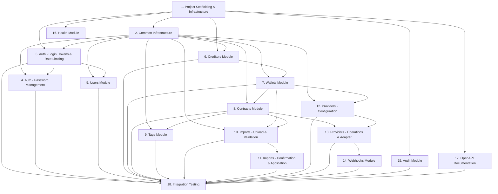

# Implementation Plan:

## Overview

Implementation plan for the CobData Backend MVP — a NestJS REST API with TypeScript strict mode, Prisma ORM, BullMQ async processing, and Serasa LNOP provider integration. The plan covers 18 task groups (102 sub-tasks) spanning project scaffolding, authentication, RBAC, business modules (creditors, wallets, contracts, imports, providers, webhooks), audit, health, documentation, and integration testing.

## Tasks

- [x] 1. Project Scaffolding & Infrastructure
  - [x] 1.1 Initialize NestJS project with TypeScript strict mode, ESLint, Prettier
    - **Requirements**: N/A (foundational)
    - **Details**: `nest new` with strict tsconfig (`strictNullChecks`, `noImplicitAny`, `noUncheckedIndexedAccess`). Configure ESLint + Prettier. Set global prefix `/api`. Add Jest for testing.
  - [x] 1.2 Configure Docker Compose with PostgreSQL, Redis, and MinIO services
    - **Requirements**: N/A (foundational)
    - **Details**: `docker-compose.yml` with postgres:16, redis:7, minio. Health checks. `.env.example` with all required env vars.
  - [x] 1.3 Set up Prisma ORM with full schema, enums, and indexes
    - **Requirements**: 7.1, 7.3
    - **Details**: Create `prisma/schema.prisma` with all models from design. All enums. All indexes. Generate initial migration. PrismaModule + PrismaService.
  - [x] 1.4 Configure environment validation with Zod schemas
    - **Requirements**: N/A (foundational)
    - **Details**: `src/config/` with Zod schemas for all env vars (DB, Redis, JWT, S3, Serasa). NestJS ConfigModule with validate function.
  - [x] 1.5 Set up BullMQ module with Redis connection
    - **Requirements**: N/A (foundational)
    - **Details**: Install `@nestjs/bullmq`. Register queues: `import-validation`, `import-application`, `provider-operation`. Configure from env.
  - [x] 1.6 Set up S3-compatible storage module (MinIO)
    - **Requirements**: N/A (foundational)
    - **Details**: StorageModule with S3 client (aws-sdk v3). Upload, download, delete. Bucket auto-creation on startup.
  - [x] 1.7 Create database seed with initial Account and ADMIN user
    - **Requirements**: 7.1
    - **Details**: Seed creates single Account + ADMIN user with configurable email/password via env. Idempotent.
  - [x] 1.8 Set up global exception filter and error response format
    - **Requirements**: N/A (foundational)
    - **Details**: `GlobalExceptionFilter` returning `{ statusCode, error, message, requestId, timestamp }`. Handle Prisma, validation, HTTP exceptions. Attach requestId UUID v4 via middleware.
  - [x] 1.9 Configure global ValidationPipe with class-validator
    - **Requirements**: N/A (foundational)
    - **Details**: Enable `whitelist`, `forbidNonWhitelisted`, `transform`. Base pagination DTO (page, limit defaults 1/20, max 100).

- [x] 2. Common Infrastructure (Guards, Decorators, Interceptors)
  - [x] 2.1 Create JWT auth guard and strategy (Passport)
    - **Requirements**: 1.1, 3.2, 7.2
    - **Depends on**: Task 1
    - **Details**: `JwtStrategy` validating AccessToken. Payload: `{ sub, accountId, role, sessionId, iat, exp }`. Register as global APP_GUARD. Create `@Public()` decorator to skip auth.
  - [x] 2.2 Create Roles guard and @Roles decorator
    - **Requirements**: 8.1, 8.2, 8.3
    - **Depends on**: Task 2.1
    - **Details**: `RolesGuard` checking `user.role` against `@Roles(...)` metadata. If no `@Roles` decorator, allow all authenticated users.
  - [x] 2.3 Create Scope guard for VIEWER wallet filtering
    - **Requirements**: 8.3, 8.4, 8.5, 8.6
    - **Depends on**: Task 2.2
    - **Details**: `ScopeGuard` for VIEWER role checks if requested walletId is in user's scopes. Load scopes from DB (UserScope table). Cache in request context.
  - [x] 2.4 Create @CurrentUser decorator
    - **Requirements**: N/A (utility)
    - **Depends on**: Task 2.1
    - **Details**: Parameter decorator extracting user from request. Returns `{ id, accountId, role, sessionId }`.
  - [x] 2.5 Create AuditInterceptor for automatic action logging
    - **Requirements**: 20.1, 20.2, 20.3, 20.4, 20.5
    - **Depends on**: Task 1
    - **Details**: NestJS interceptor logging action, userId, resourceType, resourceId, requestId, ipAddress. Best-effort (catch errors). Metadata max 4KB, no PII.
  - [x] 2.6 Create TransformInterceptor for response envelope
    - **Requirements**: N/A (utility)
    - **Depends on**: Task 1
    - **Details**: Consistent response format. Pagination shape: `{ data, meta: { total, page, limit, totalPages } }`. Add requestId to headers.

- [x] 3. Auth Module — Login, Tokens & Rate Limiting
  - [x] 3.1 Implement PasswordService with Argon2id hashing and complexity validation
    - **Requirements**: 1.4, 4.2, 5.1
    - **Depends on**: Task 1
    - **Details**: Hash with argon2id. Verify method. Validate complexity: min 8 chars, 1 uppercase, 1 lowercase, 1 digit.
  - [x] 3.2 Implement TokenService for JWT and RefreshToken generation
    - **Requirements**: 1.1, 2.1, 3.2, 7.2
    - **Depends on**: Task 1, Task 2
    - **Details**: Generate AccessToken (15min, payload: sub, accountId, role, sessionId, iat, exp only). Generate RefreshToken (7 days, opaque + SHA-256 hash in Session). Cookie: HttpOnly, Secure, SameSite based on env.
  - [x] 3.3 Implement SessionService for session CRUD and invalidation
    - **Requirements**: 6.1, 6.2, 6.3, 6.4, 6.5
    - **Depends on**: Task 1, Task 3.2
    - **Details**: Create session (tokenFamily, refreshTokenHash, userAgent, ipAddress). List. Revoke single (not current). Revoke all except current. Revoke by tokenFamily.
  - [x] 3.4 Implement login endpoint with rate limiting
    - **Requirements**: 1.1, 1.2, 1.3, 1.4, 1.5, 1.6
    - **Depends on**: Task 3.1, Task 3.2, Task 3.3
    - **Details**: `POST /auth/login` — validate email/password, check isActive, check rate limit (Redis `login:attempts:{email}` TTL 15min, block after 5). Return AccessToken body + RefreshToken cookie. Failure: increment counter, 401 generic. Rate limited: 429 with retryAfterSeconds.
  - [x] 3.5 Implement refresh token rotation endpoint
    - **Requirements**: 2.1, 2.2, 2.4
    - **Depends on**: Task 3.2, Task 3.3
    - **Details**: `POST /auth/refresh` — read cookie, verify hash, check not revoked/expired. Reuse detection → invalidate family. Rotate: new tokens, update session. Return new AccessToken + cookie.
  - [x] 3.6 Implement logout endpoint
    - **Requirements**: 2.3
    - **Depends on**: Task 3.3
    - **Details**: `POST /auth/logout` — revoke session, clear cookies, return 204.
  - [x] 3.7 Implement GET /auth/me endpoint
    - **Requirements**: 3.1, 3.2, 3.3
    - **Depends on**: Task 2, Task 1
    - **Details**: Return userId, email, role, scopes (walletIds for VIEWER, empty for others). Must respond <500ms.
  - [x] 3.8 Implement GET/DELETE /auth/sessions endpoints
    - **Requirements**: 6.2, 6.3, 6.4
    - **Depends on**: Task 3.3, Task 2
    - **Details**: `GET /auth/sessions` — list with sessionId, userAgent, ipAddress, createdAt, isCurrent. `DELETE /auth/sessions/:id` — if sessionId is the current session, reject with HTTP 409. Otherwise revoke and return 204. `DELETE /auth/sessions` — revoke all except current.
  - [x] 3.9 Write property test: JWT structure invariant (Property 1)
    - **Requirements**: 3.2, 1.1, 7.2
    - **Depends on**: Task 3.2
    - **Details**: Verify JWT contains exactly `sub, accountId, role, sessionId, iat, exp` with exp = iat + 15min. No extra fields.
  - [x] 3.10 Write property test: uniform invalid credentials response (Property 2)
    - **Requirements**: 1.2, 1.3
    - **Depends on**: Task 3.4
    - **Details**: Wrong email, wrong password, inactive user: all return 401 with identical structure.
  - [x] 3.11 Write property test: rate limiting threshold (Property 3)
    - **Requirements**: 1.5, 1.6
    - **Depends on**: Task 3.4
    - **Details**: After 5 consecutive failures within 15min, next attempt returns 429 with correct retryAfterSeconds.

- [x] 4. Auth Module — Password Management
  - [x] 4.1 Implement change-password endpoint
    - **Requirements**: 5.1, 5.2, 6.5
    - **Depends on**: Task 3.1, Task 3.3, Task 2
    - **Details**: `POST /auth/change-password` — verify current password, validate new complexity, update hash, invalidate all sessions except current.
  - [x] 4.2 Implement forgot-password endpoint
    - **Requirements**: 5.3
    - **Depends on**: Task 3.1, Task 1
    - **Details**: `POST /auth/forgot-password` — generate reset token (1h), store in DB, send email (stub). Always return 202.
  - [x] 4.3 Implement reset-password endpoint
    - **Requirements**: 5.4, 5.5
    - **Depends on**: Task 3.1, Task 3.3
    - **Details**: `POST /auth/reset-password` — validate token (not expired/used), update hash, invalidate token, revoke all sessions.
  - [x] 4.4 Implement must-reset-password restricted token flow
    - **Requirements**: 5.6, 5.7
    - **Depends on**: Task 3.4, Task 4.1, Task 2
    - **Details**: When `mustResetPassword=true` + login success: issue restricted token. Guard blocks all except change-password for restricted tokens.
  - [x] 4.5 Write property test: password complexity enforcement (Property 29)
    - **Requirements**: 4.2, 5.1
    - **Depends on**: Task 3.1
    - **Details**: Password accepted iff length >= 8, at least 1 uppercase, 1 lowercase, 1 digit.
  - [x] 4.6 Write property test: forgot-password non-leakage (Property 28)
    - **Requirements**: 5.3
    - **Depends on**: Task 4.2
    - **Details**: For any email (existing or not), POST /auth/forgot-password returns 202 with identical response.

- [x] 5. Users Module — Invites & CRUD
  - [x] 5.1 Implement user invite endpoint
    - **Requirements**: 4.1, 4.4, 4.7, 4.9
    - **Depends on**: Task 1, Task 2
    - **Details**: `POST /users/invite` (ADMIN only) — validate email, check no duplicate active user (409), create User (isActive=false), create Invite (token 72h), send email (stub). 2FA fields in model.
  - [x] 5.2 Implement user activation endpoint
    - **Requirements**: 4.2, 4.3
    - **Depends on**: Task 5.1, Task 3.1
    - **Details**: `POST /auth/activate` — validate token (not expired/used, 410 if invalid), validate password complexity, set hash, isActive=true, invite=ACCEPTED.
  - [x] 5.3 Implement users listing and update endpoints
    - **Requirements**: 4.5, 4.6, 4.10
    - **Depends on**: Task 5.1, Task 2
    - **Details**: `GET /users` (ADMIN) — paginated with status filter. `PATCH /users/:id` (ADMIN) — update role, scopes, isActive. Reject PATCH that would deactivate or demote the last active ADMIN with HTTP 409.
  - [x] 5.4 Implement resend-invite endpoint
    - **Requirements**: 4.8
    - **Depends on**: Task 5.1
    - **Details**: `POST /users/:id/resend-invite` (ADMIN) — only PENDING users. Invalidate old token, new 72h token, resend email.
  - [x] 5.5 Implement force-reset endpoint
    - **Requirements**: 5.6
    - **Depends on**: Task 3.3, Task 2
    - **Details**: `POST /users/:id/force-reset` (ADMIN) — set mustResetPassword=true, revoke all sessions.

- [x] 6. Creditors Module
  - [x] 6.1 Implement CNPJ validation utility
    - **Requirements**: 9.5
    - **Depends on**: Task 1
    - **Details**: Validate 14-digit CNPJ with Receita Federal check digit algorithm. Reusable in DTOs and import validation.
  - [x] 6.2 Implement creditor CRUD endpoints
    - **Requirements**: 9.1, 9.2, 9.3, 9.4, 9.5, 9.6, 9.7, 9.8, 9.8b
    - **Depends on**: Task 1, Task 2, Task 6.1
    - **Details**: `POST /creditors` (ADMIN, OPERATIONAL) — name 1-255, optional CNPJ, contacts max 10, address. `GET /creditors` — paginated, search name/CNPJ, exclude soft-deleted. `GET /creditors/:id`. `PATCH /creditors/:id`. CNPJ uniqueness (409). VIEWER: 403 on write.
  - [x] 6.3 Implement creditor soft-delete with cascade validation
    - **Requirements**: 9.9, 9.10, 9.11
    - **Depends on**: Task 6.2
    - **Details**: `DELETE /creditors/:id` (ADMIN) — check no wallets with contracts (409). Soft-delete creditor + cascade soft-delete wallets.
  - [x] 6.4 Implement VIEWER scope filtering for creditors
    - **Requirements**: 9.12
    - **Depends on**: Task 6.2, Task 2.3
    - **Details**: VIEWER lists only creditors with at least one wallet in their scopes.
  - [x] 6.5 Write property test: CNPJ validation correctness (Property 9)
    - **Requirements**: 9.5
    - **Depends on**: Task 6.1
    - **Details**: For any 14-digit string, accept iff check digits correct. All others rejected.

- [x] 7. Wallets Module
  - [x] 7.1 Implement wallet CRUD endpoints
    - **Requirements**: 10.1, 10.2, 10.3, 10.4, 10.4b, 10.5
    - **Depends on**: Task 1, Task 6.2, Task 2
    - **Details**: `POST /creditors/:creditorId/wallets` (ADMIN, OPERATIONAL) — name 1-120 trimmed, status ACTIVE. `GET /wallets` — paginated, search name. `GET /wallets/:id` — with summary (totalContracts, contractsByStatus, totalValue). `PATCH /wallets/:id` — name, status ACTIVE/INACTIVE.
  - [x] 7.2 Implement wallet soft-delete
    - **Requirements**: 10.7, 10.8, 10.9
    - **Depends on**: Task 7.1
    - **Details**: `DELETE /wallets/:id` (ADMIN) — check no contracts (409). Soft-delete. OPERATIONAL/VIEWER: 403.
  - [x] 7.3 Implement VIEWER scope enforcement for wallets
    - **Requirements**: 10.10, 8.3, 8.4, 8.5
    - **Depends on**: Task 7.1, Task 2.3
    - **Details**: VIEWER: only wallets in scopes. List filtered. Direct access 403 if out of scope.
  - [x] 7.4 Write property test: scope-based data isolation (Property 7)
    - **Requirements**: 8.3, 8.4, 8.5, 8.6
    - **Depends on**: Task 7.3
    - **Details**: VIEWER with scopes S: listings return only resources in S. Access to wallet NOT in S returns 403.

- [x] 8. Contracts Module — Core CRUD
  - [x] 8.1 Implement DeduplicationService with SHA-256 key computation
    - **Requirements**: 11.3
    - **Depends on**: Task 1
    - **Details**: `computeDeduplicationKey({ creditorId, debtorDocument, contractNumber, debtOriginDocument? })` — concatenate with `|`, SHA-256. creditorId resolved from wallet.creditorId.
  - [x] 8.2 Implement contract creation with deduplication (upsert)
    - **Requirements**: 11.1, 11.2, 11.3, 11.3b, 11.3c, 11.3d, 11.5, 11.5b, 11.6
    - **Depends on**: Task 8.1, Task 7.1, Task 2
    - **Details**: `POST /contracts` (ADMIN, OPERATIONAL) — validate required fields (walletId, debtorDocument CPF/CNPJ, contractNumber max 100, debtType enum, occurrenceDate not future, originalValue 0.01-999999999.99). Optional: updatedValue >= originalValue, debtOrigin max 100, offer. Compute dedup key. If exists same wallet: upsert. If exists different wallet: 409. Encrypt document, store hash. Set providerStatus=PENDING, status=ACTIVE.
  - [x] 8.3 Implement contract listing with pagination, filters, and masking
    - **Requirements**: 11.4, 11.7
    - **Depends on**: Task 8.2, Task 2.3
    - **Details**: `GET /contracts` — paginated (20/100). Filters: walletId, creditorId, status, providerStatus, dateRange, debtorDocument. VIEWER: mask document (last 4). VIEWER: scope-filtered. No results: empty list with zeroed pagination meta.
  - [x] 8.4 Implement contract PATCH with providerStatus and status guards
    - **Requirements**: 11.8, 11.8b, 11.8c, 11.8d, 11.8e, 11.12
    - **Depends on**: Task 8.2
    - **Details**: `PATCH /contracts/:id` (ADMIN, OPERATIONAL) — only if providerStatus in {PENDING, FAILED, REMOVED}. Update values, dates, debtType, walletId, status. Internal status transitions: ACTIVE<->SUSPENDED, ACTIVE->CANCELLED, SUSPENDED->CANCELLED only. walletId change: dest must exist + ACTIVE. providerStatus not editable via PATCH.
  - [x] 8.5 Implement contract soft-delete with providerStatus guard
    - **Requirements**: 11.9, 11.10
    - **Depends on**: Task 8.2
    - **Details**: `DELETE /contracts/:id` (ADMIN, OPERATIONAL) — only if providerStatus in {PENDING, FAILED, REMOVED}. Others: 409. VIEWER: 403.
  - [x] 8.6 Write property test: deduplication idempotent upsert (Property 10)
    - **Requirements**: 11.3, 11.5
    - **Depends on**: Task 8.2
    - **Details**: Same key + same wallet -> update. Same key + different wallet -> 409. No duplicates created.
  - [x] 8.7 Write property test: providerStatus edit restriction (Property 11)
    - **Requirements**: 11.8, 11.9
    - **Depends on**: Task 8.4
    - **Details**: PATCH succeeds only when providerStatus in {PENDING, FAILED, REMOVED}. Others -> 409.
  - [x] 8.8 Write property test: internal status transitions (Property 12)
    - **Requirements**: 11.8b
    - **Depends on**: Task 8.4
    - **Details**: Only ACTIVE<->SUSPENDED, ACTIVE->CANCELLED, SUSPENDED->CANCELLED. Others rejected.
  - [x] 8.9 Write property test: document masking for VIEWER (Property 30)
    - **Requirements**: 11.4
    - **Depends on**: Task 8.3
    - **Details**: VIEWER sees last 4 chars only. ADMIN/OPERATIONAL see full document.

- [x] 9. Tags Module
  - [x] 9.1 Implement tag add/remove endpoints
    - **Requirements**: 12.1, 12.2, 12.3, 12.4, 12.7
    - **Depends on**: Task 8.2, Task 2
    - **Details**: `POST /contracts/:id/tags` (ADMIN, OPERATIONAL) — tags max 50 chars each, normalize lowercase+trim, limit 20 total per contract. `DELETE /contracts/:id/tags` — remove specified. VIEWER: 403.
  - [x] 9.2 Implement tag listing endpoint
    - **Requirements**: 12.6
    - **Depends on**: Task 9.1, Task 2.3
    - **Details**: `GET /tags` — distinct tags with contract count. VIEWER: filtered by scoped wallets only.
  - [x] 9.3 Implement tag-based filtering in contract listing
    - **Requirements**: 12.5
    - **Depends on**: Task 9.1, Task 8.3
    - **Details**: Add `tags` query param to `GET /contracts`. AND logic: contract must have ALL specified tags.
  - [x] 9.4 Write property test: tag normalization idempotence (Property 14)
    - **Requirements**: 12.3
    - **Depends on**: Task 9.1
    - **Details**: Storing tag produces lowercase(trim(tag)). Tags differing only in case/whitespace are same tag.
  - [x] 9.5 Write property test: tag AND filter logic (Property 15)
    - **Requirements**: 12.5
    - **Depends on**: Task 9.3
    - **Details**: For filter tags T, every result has ALL tags in T. No contract missing any tag appears.
  - [x] 9.6 Write property test: tag limit enforcement (Property 16)
    - **Requirements**: 12.2
    - **Depends on**: Task 9.1
    - **Details**: Adding M tags when N exist and N+M (after dedup) > 20 -> 422. Existing tags unchanged.

- [x] 10. Imports Module — Upload & Validation
  - [x] 10.1 Implement import upload endpoint
    - **Requirements**: 13.1, 13.2, 13.3, 13.4, 13.5, 13.6, 13.7, 13.8
    - **Depends on**: Task 1, Task 7.1, Task 2
    - **Details**: `POST /imports` (multipart, ADMIN/OPERATIONAL) — validate extension (.csv/.xlsx), size (100MB), not empty. Validate walletId exists+ACTIVE+not deleted. Upload to S3. Create ImportBatch (PENDING_VALIDATION). Parse total lines. Schedule BullMQ validation job. Return 201.
  - [x] 10.2 Implement validation worker (BullMQ processor)
    - **Requirements**: 14.1, 14.2, 14.4, 14.5, 14.5b, 14.5c, 14.8
    - **Depends on**: Task 10.1, Task 8.1
    - **Details**: `ValidationProcessor` — download from S3, parse lines with column mapping. Validate required fields, formats, ranges. Check dedup conflicts (PROVIDER_CONFLICT if providerStatus not in PENDING/FAILED/REMOVED, WALLET_MISMATCH if different wallet). Update counters. Set status VALIDATED/VALIDATED_WITH_ERRORS/VALIDATION_FAILED. Worker must periodically check batch status (every 500 lines) and abort gracefully if CANCELLED is detected, preserving partial results.
  - [x] 10.3 Implement import error listing endpoint
    - **Requirements**: 14.3
    - **Depends on**: Task 10.2
    - **Details**: `GET /imports/:batchId/errors` — paginated max 50/page. lineNumber, errorCode, fieldName, message, maskedFieldValue (last 4 for PII).
  - [x] 10.4 Implement import batch listing and detail endpoints
    - **Requirements**: 14.6, 14.7
    - **Depends on**: Task 10.1, Task 2.3
    - **Details**: `GET /imports` — paginated with status/wallet filters. VIEWER: scope-filtered. `GET /imports/:batchId` — full detail.
  - [x] 10.5 Implement import cancel endpoint
    - **Requirements**: 14.8, 14.9
    - **Depends on**: Task 10.1
    - **Details**: `POST /imports/:batchId/cancel` (ADMIN, OPERATIONAL) — valid from PENDING_VALIDATION/VALIDATING/VALIDATED/VALIDATED_WITH_ERRORS. 409 if APPLYING/APPLIED/FAILED.
  - [x] 10.6 Write property test: import line validation correctness (Property 17)
    - **Requirements**: 14.1, 14.5b, 14.5c
    - **Depends on**: Task 10.2
    - **Details**: Line valid iff all fields present+valid+no PROVIDER_CONFLICT+no WALLET_MISMATCH. Otherwise invalid with correct error code.

- [x] 11. Imports Module — Confirmation & Application
  - [x] 11.1 Implement import confirmation endpoint
    - **Requirements**: 15.1, 15.3, 15.3b
    - **Depends on**: Task 10.2
    - **Details**: `POST /imports/:batchId/confirm` (ADMIN, OPERATIONAL) — only from VALIDATED/VALIDATED_WITH_ERRORS. Set status APPLYING. Schedule application job. If already APPLYING/APPLIED: return current state. If PENDING_VALIDATION/VALIDATING/CANCELLED/FAILED: 409.
  - [x] 11.2 Implement application worker (BullMQ processor)
    - **Requirements**: 15.2, 15.4, 15.5
    - **Depends on**: Task 11.1, Task 8.1, Task 8.2
    - **Details**: `ApplicationProcessor` — for each valid line: compute dedup key. CREATE if no match. UPDATE if match with different values. IGNORE if identical. Reactivate SUSPENDED/CANCELLED contracts on update. Transactional. Update counters (createdCount, updatedCount, ignoredCount). Set APPLIED on success. Retry 3x with exponential backoff, then FAILED.
  - [x] 11.3 Write property test: import application three-way decision (Property 18)
    - **Requirements**: 15.2
    - **Depends on**: Task 11.2
    - **Details**: No existing match -> CREATE. Match with different values -> UPDATE. Match with identical -> IGNORE. Counters reflect actions.
  - [x] 11.4 Write property test: import reactivates suspended/cancelled (Property 19)
    - **Requirements**: 15.2
    - **Depends on**: Task 11.2
    - **Details**: DeduplicationKey matches SUSPENDED/CANCELLED contract -> update fields AND set status ACTIVE.

- [x] 12. Providers Module — Configuration
  - [x] 12.1 Implement provider configuration CRUD
    - **Requirements**: 16.1, 16.2, 16.4, 16.5, 16.7, 16.7b, 16.8, 16.9
    - **Depends on**: Task 1, Task 2
    - **Details**: `POST /providers` (ADMIN) — type (SERASA_LNOP), environment (HOMOLOGATION/PRODUCTION), credentials (encrypted AES-256-GCM at rest). One config per type (409 duplicate). `GET /providers` (ADMIN, OPERATIONAL) — list without credentials. `PATCH /providers/:id` (ADMIN) — update env/credentials. No delete endpoint.
  - [x] 12.2 Implement wallet mapping endpoints
    - **Requirements**: 16.3, 16.6, 16.10
    - **Depends on**: Task 12.1, Task 7.1
    - **Details**: `POST /providers/:id/wallet-mappings` (ADMIN) — map local walletId to externalWalletId. Validate wallet exists, not soft-deleted, not INACTIVE. `GET /providers/:id/wallet-mappings`. `DELETE /providers/:id/wallet-mappings/:mappingId`.

- [x] 13. Providers Module — Operations & Serasa Adapter
  - [x] 13.1 Implement ProviderAdapter interface and SerasaLnopAdapter
    - **Requirements**: 18.1, 18.2, 18.3, 18.4, 18.5, 18.6, 18.7, 18.8
    - **Depends on**: Task 12.1
    - **Details**: Interface: `sendDebts(items, config)`, `removeDebts(items, config)`, `validateWebhookSignature(headers, body, secret)`. SerasaLnopAdapter: POST /debts/create (max 1000), POST /debts/remove. 30s timeout. Retry on 5xx/429 (3x, 30s exponential). No retry on 4xx. Store transactionId+debtId on 202.
  - [x] 13.2 Implement operation creation endpoint
    - **Requirements**: 17.1, 17.2, 17.9
    - **Depends on**: Task 13.1, Task 8.2, Task 12.2
    - **Details**: `POST /operations` (ADMIN, OPERATIONAL) — walletId + action (CREATE_OR_UPDATE or REMOVE). Select eligible contracts: status=ACTIVE AND providerStatus eligible AND required fields present AND wallet mapped AND deletedAt IS NULL. If 0 eligible: 422. Create ProviderOperation + Items. Divide into batches of 1000. Schedule BullMQ jobs. Return 201 within 3s.
  - [x] 13.3 Implement operation processing worker
    - **Requirements**: 17.3, 17.4, 17.5
    - **Depends on**: Task 13.2, Task 13.1
    - **Details**: Worker processes one batch: call adapter. On 202: items -> WAITING_PROVIDER_EVENT, store transactionId. On error: items -> FAILED with error details. After all batches: set operation status (COMPLETED/FAILED/PARTIALLY_FAILED).
  - [x] 13.4 Implement operation listing and cancel endpoints
    - **Requirements**: 17.6, 17.7, 17.8
    - **Depends on**: Task 13.2, Task 2.3
    - **Details**: `GET /operations` — paginated, VIEWER scope-filtered. `GET /operations/:id` — detail with items. `POST /operations/:id/cancel` (ADMIN, OPERATIONAL) — cancel PENDING/PROCESSING ops. Cancel enqueued jobs.
  - [x] 13.5 Write property test: operation batching invariant (Property 20)
    - **Requirements**: 17.2, 18.1, 18.2
    - **Depends on**: Task 13.2
    - **Details**: N eligible contracts -> ceil(N/1000) batches. Each <= 1000 items. Union = N contracts exactly.
  - [x] 13.6 Write property test: eligible contracts selection (Property 21)
    - **Requirements**: 17.1
    - **Depends on**: Task 13.2
    - **Details**: CREATE_OR_UPDATE: status=ACTIVE, providerStatus in {PENDING, FAILED}, fields present, wallet mapped. REMOVE: providerStatus in {REGISTERED, UPDATED}, valid debtId.
  - [x] 13.7 Write property test: suspended/cancelled excluded from operations (Property 13)
    - **Requirements**: 11.8c, 17.1
    - **Depends on**: Task 13.2
    - **Details**: Contracts with status SUSPENDED or CANCELLED never in eligible set regardless of providerStatus.

- [x] 14. Webhooks Module
  - [x] 14.1 Implement webhook reception endpoint
    - **Requirements**: 19.1, 19.2, 19.7, 19.9, 19.13, 19.14
    - **Depends on**: Task 13.1, Task 12.1
    - **Details**: `POST /webhooks/serasa` (outside /api prefix, @Public). Validate HMAC signature (401 if invalid). Persist WebhookEvent. Dedup by (transactionId, eventType) — if duplicate: 200 without reprocessing. If transactionId unmatched: persist as UNMATCHED, return 200. Respond within 5s.
  - [x] 14.2 Implement webhook event processing (DebtCreatedEvent)
    - **Requirements**: 19.3, 19.4, 19.5, 19.6
    - **Depends on**: Task 14.1
    - **Details**: DebtCreatedEvent(201): item -> REGISTERED, contract -> REGISTERED. DebtCreatedEvent(204): item -> UPDATED, contract -> UPDATED. Error status (400/401/500): item -> FAILED with error details.
  - [x] 14.3 Implement webhook event processing (DebtRemovedEvent)
    - **Requirements**: 19.10, 19.12
    - **Depends on**: Task 14.1
    - **Details**: DebtRemovedEvent(200): item -> REMOVED, contract -> REMOVED. Error status: item -> FAILED, contract stays REMOVING.
  - [x] 14.4 Implement webhook event processing (Agreement events)
    - **Requirements**: 19.8, 19.11
    - **Depends on**: Task 14.1
    - **Details**: ClosedAgreementEvent: contract -> IN_AGREEMENT. BreachedAgreementEvent: contract -> AGREEMENT_BREACHED. PaidAgreementEvent: contract -> PAID. PaidInstallmentEvent: increment paidInstallments counter, no providerStatus change.
  - [x] 14.5 Write property test: webhook idempotence (Property 22)
    - **Requirements**: 19.7
    - **Depends on**: Task 14.1
    - **Details**: Duplicate (transactionId, eventType) -> 200 without modifying any state.
  - [x] 14.6 Write property test: webhook event to contract status mapping (Property 23)
    - **Requirements**: 19.4, 19.5, 19.8, 19.10
    - **Depends on**: Task 14.2, Task 14.3, Task 14.4
    - **Details**: DebtCreated(201)->REGISTERED, (204)->UPDATED, DebtRemoved(200)->REMOVED, ClosedAgreement->IN_AGREEMENT, Breached->AGREEMENT_BREACHED, Paid->PAID.
  - [x] 14.7 Write property test: webhook signature rejection (Property 24)
    - **Requirements**: 19.2
    - **Depends on**: Task 14.1
    - **Details**: Invalid/missing signature -> 401. No event persisted. No state modified.
  - [x] 14.8 Write property test: unmatched webhook graceful handling (Property 25)
    - **Requirements**: 19.9
    - **Depends on**: Task 14.1
    - **Details**: Unknown transactionId -> persist as UNMATCHED, return 200.

- [x] 15. Audit Module
  - [x] 15.1 Implement AuditService with structured logging
    - **Requirements**: 20.1, 20.2, 20.3, 20.4, 20.5
    - **Depends on**: Task 1
    - **Details**: `AuditService.log(entry)` — persist AuditLog record with action, userId, resourceType, resourceId, requestId, operationId, jobId, ipAddress, metadata (<4KB, no PII). Best-effort: catch and log errors without blocking.
  - [x] 15.2 Implement AuditController for log querying
    - **Requirements**: 20.6, 20.7
    - **Depends on**: Task 15.1, Task 2
    - **Details**: `GET /audit-logs` (ADMIN only) — paginated with filters: action, userId, resourceType, resourceId, period (startDate/endDate). OPERATIONAL/VIEWER: 403.
  - [x] 15.3 Write property test: audit entry structural completeness (Property 26)
    - **Requirements**: 20.1, 20.2
    - **Depends on**: Task 15.1
    - **Details**: Every audit entry has action, userId (when applicable), resourceType, resourceId, timestamp ISO 8601, requestId UUID v4. Metadata <= 4KB.
  - [x] 15.4 Write property test: audit entries exclude PII (Property 27)
    - **Requirements**: 20.4
    - **Depends on**: Task 15.1
    - **Details**: No audit metadata contains CPF, CNPJ, email, phone, password, or JWT values.

- [x] 16. Health Module
  - [x] 16.1 Implement liveness endpoint
    - **Requirements**: 21.1, 21.4, 21.5, 21.6
    - **Depends on**: Task 1
    - **Details**: `GET /health/live` (@Public, no auth) — return 200 with `{ service, version, uptime }` in <100ms. No secrets or internal config exposed.
  - [x] 16.2 Implement readiness endpoint
    - **Requirements**: 21.2, 21.3, 21.4, 21.5, 21.6
    - **Depends on**: Task 1
    - **Details**: `GET /health/ready` (@Public) — check PostgreSQL (3s timeout), Redis (3s timeout), BullMQ queues. Return 200 if all OK with dependency status + queue metrics. Return 503 if any dependency fails. Total timeout 5s. No secrets exposed.

- [x] 17. OpenAPI Documentation
  - [x] 17.1 Configure Swagger/OpenAPI module with NestJS decorators
    - **Requirements**: 22.1, 22.2, 22.3, 22.4
    - **Depends on**: Task 1
    - **Details**: Install `@nestjs/swagger`. Configure OpenAPI 3.1. Expose at `/docs` in dev/homologation (no auth required). Disable or require auth in production. Document all DTOs with `@ApiProperty`, error schemas, Bearer JWT auth scheme, pagination params, enum values.
  - [x] 17.2 Add OpenAPI decorators to all controllers
    - **Requirements**: 22.4, 22.5
    - **Depends on**: Task 17.1, all controller tasks
    - **Details**: Ensure every endpoint has `@ApiOperation`, `@ApiResponse` (success + error codes), `@ApiParam`, `@ApiQuery`. Add startup validation that warns about undocumented routes.

- [x] 18. Integration Testing & Final Validation
  - [x] 18.1 Write integration tests for auth flow (login -> refresh -> logout)
    - **Requirements**: 1.1, 2.1, 2.3
    - **Depends on**: Task 3.4, Task 3.5, Task 3.6
    - **Details**: End-to-end test: login returns tokens, refresh rotates correctly, logout invalidates session. Use test database.
  - [x] 18.2 Write integration tests for RBAC enforcement across modules
    - **Requirements**: 8.1, 8.2, 8.3
    - **Depends on**: All module tasks
    - **Details**: Verify ADMIN full access, OPERATIONAL restricted (no user mgmt, no delete, no provider config), VIEWER read-only + scope-filtered.
  - [x] 18.3 Write property test: role-based action authorization (Property 8)
    - **Requirements**: 8.1, 8.2, 8.3
    - **Depends on**: Task 18.2
    - **Details**: For any endpoint+method: ADMIN permitted all. OPERATIONAL permitted read/write business but denied user mgmt, provider config, delete. VIEWER denied all writes.
  - [x] 18.4 Write property test: refresh token rotation round-trip (Property 4)
    - **Requirements**: 2.1
    - **Depends on**: Task 3.5
    - **Details**: Valid RefreshToken -> new AccessToken + new RefreshToken. Old token invalidated. Same family.
  - [x] 18.5 Write property test: refresh token reuse detection (Property 5)
    - **Requirements**: 2.2
    - **Depends on**: Task 3.5
    - **Details**: Replay consumed RefreshToken -> invalidate ALL tokens in family. Zero valid sessions in family.
  - [x] 18.6 Write property test: session invalidation preserves current (Property 6)
    - **Requirements**: 6.3, 6.4, 6.5
    - **Depends on**: Task 3.8, Task 4.1
    - **Details**: Bulk invalidation (logout-all, password change) -> all sessions revoked except current. Exactly 1 remaining.

## Task Dependency Graph



```json
{
  "waves": [
    {
      "wave": 1,
      "tasks": [1],
      "description": "Project scaffolding and infrastructure setup"
    },
    {
      "wave": 2,
      "tasks": [2, 15, 16, 17],
      "description": "Common infrastructure, audit, health, and documentation setup"
    },
    {
      "wave": 3,
      "tasks": [3, 6],
      "description": "Authentication core and creditors module"
    },
    {
      "wave": 4,
      "tasks": [4, 5, 7, 12],
      "description": "Password management, users, wallets, and provider configuration"
    },
    {
      "wave": 5,
      "tasks": [8],
      "description": "Contracts module core CRUD"
    },
    {
      "wave": 6,
      "tasks": [9, 10, 13],
      "description": "Tags, imports upload, and provider operations"
    },
    {
      "wave": 7,
      "tasks": [11, 14],
      "description": "Import application and webhooks"
    },
    {
      "wave": 8,
      "tasks": [18],
      "description": "Integration testing and final validation"
    }
  ]
}
```

## Notes

- All tasks assume the NestJS modular architecture described in the design document.
- Property-based tests (PBT) are integrated within their respective module tasks rather than as a separate phase.
- Task 17.2 (OpenAPI decorators) depends on all controller tasks being completed first.
- Task 18 (Integration Testing) is the final validation phase and depends on all prior module implementations.
- The Serasa LNOP adapter uses a stub/mock in development; real integration requires provider credentials configured via Task 12.
- Email sending is stubbed in MVP — Tasks 4.2, 5.1, 5.4 use a placeholder email service.
- Single-tenant constraint: all resources share one Account created via seed (Task 1.7).
