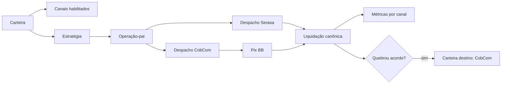

# Design — Canais e Estratégias de Cobrança

## Modelo proposto

- `CollectionChannel`: tipo e configuração do canal por Account (`SERASA`, `COBCOM`).
- `CobComContactMethod`: modalidade de cada ação CobCom (`EMAIL`, `WHATSAPP`, `SMS`); não é um canal concorrente ao Serasa.
- `WalletChannel`: canais habilitados em cada carteira; suporta seleção múltipla `SERASA` e `COBCOM`, sem armazenar dados de pagamento. Inicialmente, apenas Serasa é exibido/executável na interface.
- `CollectionStrategy`: versão publicada de regras, canais, elegibilidade e transições.
- `CollectionOperation`: execução-pai de uma estratégia.
- `ChannelAction`: um contrato despachado a um canal, com status, tentativas, referência externa e métricas de interação.
- `ContractWalletHistory`: movimentação de contrato entre carteiras, motivo, origem e destino.
- `PaymentSettlement`: ganha `paymentProvider`, `attributedChannelId`, `channelActionId` e `strategyId` opcionais.
- `AgreementSnapshot`: armazena o acordo recebido da Serasa, com `agreementId`, valor total, desconto, juros, multa e parcelas (`number`, `dueDate`, `paymentLimitDate`, `value`).

`ProviderOperation` atual do Serasa deve evoluir/migrar para o papel de `ChannelAction`/operação de canal, preservando as referências e webhooks já existentes.

## Estados sugeridos de ChannelAction

`PENDING`, `PROCESSING`, `SENT`, `DELIVERED`, `VIEWED`, `CLICKED`, `PIX_GENERATED`, `AGREEMENT`, `PAID`, `FAILED`, `CANCELLED`.

Cada canal usa apenas os estados que consegue produzir. Serasa, por exemplo, pode produzir `SENT`, `AGREEMENT` e `PAID`; CobCom pode produzir `DELIVERED`, `VIEWED`, `CLICKED` e `PIX_GENERATED`, identificando a modalidade usada.

Na fase atual, somente o adaptador Serasa é executado por operação. Pix manual é uma cobrança vinculada ao contrato, sem `ChannelAction`, com origem `MANUAL_CRM`.

## Parametrização Serasa

O envio `POST /debts/create` não carrega a política regular de juros, multa e descontos. Essas regras residem na carteira externa da Serasa. A API aceita apenas a oferta pré-calculada por dívida (`value`, `dueDaysFirstInstallment`, `maxInstallments`). O CRM mantém um espelho informativo da estratégia; mudanças no CRM não alteram a Serasa até existir integração específica para isso.
