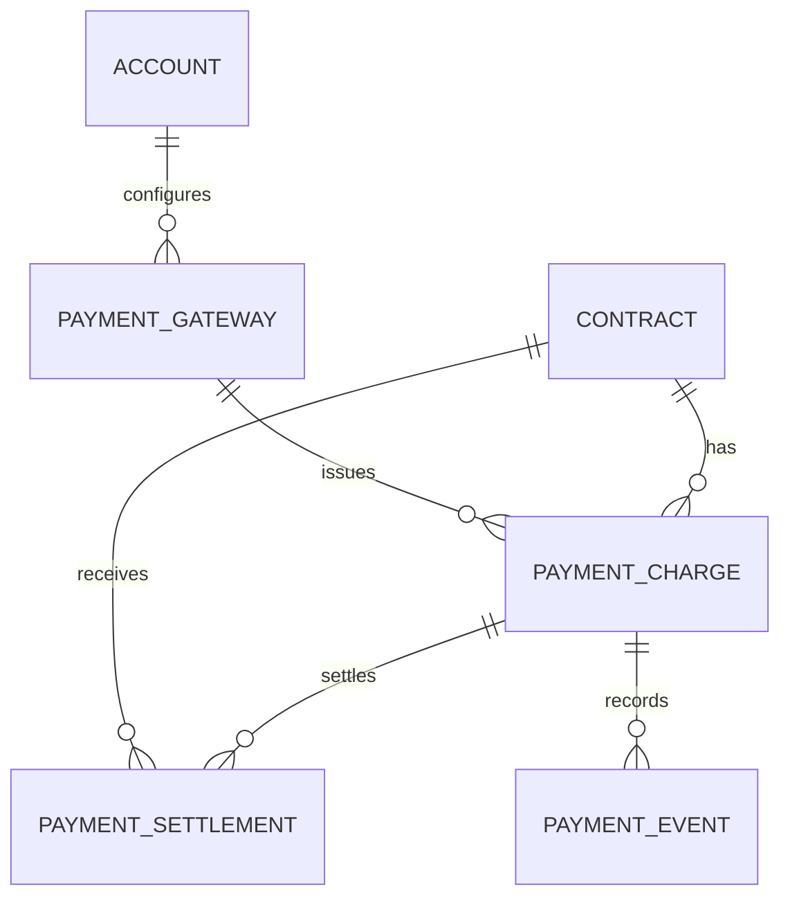
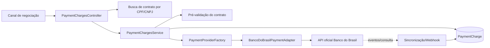
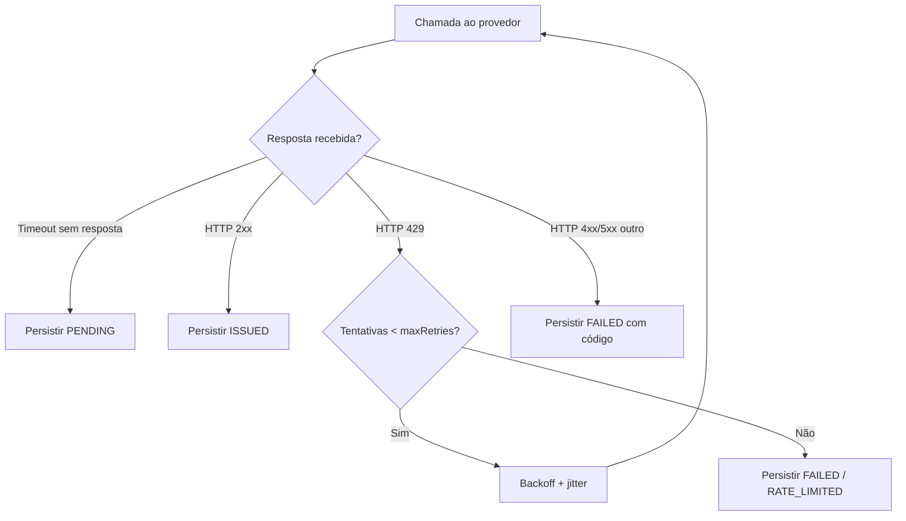
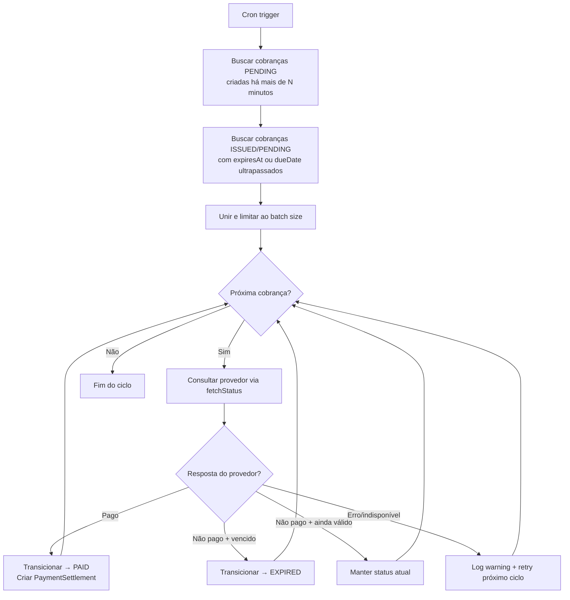

# Design — Meios de Pagamento e Banco do Brasil

## Decisões

- Pagamento é domínio próprio: não reutilizar `Provider`/`ProviderOperation`, que representam canais de cobrança e negativação.
- Cada provedor implementa uma porta (`PaymentProviderAdapter`); uma factory seleciona o adaptador pelo tipo configurado.
- A configuração guarda segredos cifrados no banco; variáveis de ambiente locais são apenas mecanismo seguro de bootstrap.
- A emissão deve ocorrer de forma síncrona apenas até o limite de timeout do provedor. Toda resposta é persistida, e sincronizações/eventos usam jobs quando necessários.

## Modelo de dados proposto



### PaymentGateway

`id`, `accountId`, `name`, `providerType`, `environment`, `enabled`, `supportedMethods`, `pixKey`, `encryptedCredentials`, `createdAt`, `updatedAt`.

Enums: `PaymentProviderType(BANCO_DO_BRASIL)` e `PaymentMethod(BOLETO, PIX, BOLEPIX)`.

### PaymentCharge

`id`, `accountId`, `contractId`, `paymentGatewayId`, `method`, `status`, `amount`, `dueDate`, `idempotencyKey`, `externalId`, `externalStatus`, `ourNumber`, `txid`, `digitableLine`, `barcode`, `pixCopyPaste`, `qrCodeUrl`, `documentUrl`, `providerPayload`, `failureCode`, `failureMessage`, `issuedAt`, `paidAt`, `expiresAt`, `attributedChannel`, timestamps.

`idempotencyKey` deve ser único dentro do meio de pagamento. Payloads persistidos devem ser minimizados e nunca incluir segredo.

### PaymentSettlement

Livro-razão imutável de recebimentos, evitando reduzir o domínio a campos isolados no contrato. Campos: `id`, `accountId`, `contractId`, `paymentChargeId?`, `agreementReference?`, `source`, `status`, `amount`, `paidAt`, `externalPaymentId`, `metadata`, `createdAt`.

- `amount` usa `Decimal(15,2)` em BRL e `paidAt` registra o instante efetivo retornado pelo provedor.
- A unicidade de `(source, externalPaymentId)` garante que webhook/reconsulta repetidos não dupliquem pagamento.
- `totalPaidAmount`, `lastPaymentAt` e saldo são projeções do livro-razão, não entradas alteráveis manualmente.
- Reversões e estornos geram novo evento com referência ao original; não removem dados de auditoria.

### Contrato canônico de retorno de pagamento

Serasa e Banco do Brasil devem ser convertidos para o mesmo contrato interno, em vez de cada integração atualizar `Contract` diretamente:

```ts
interface PaymentSettlementEvent {
  provider: 'SERASA_LNOP' | 'BANCO_DO_BRASIL' | string;
  eventType: 'PAID_AGREEMENT' | 'PAID_INSTALLMENT' | 'PIX_PAYMENT' | 'REVERSED';
  externalEventId: string;
  externalTransactionId?: string;
  contractReference: string;
  agreementReference?: string;
  installmentNumber?: number;
  amount?: string;
  amountSource?: 'PROVIDER_EVENT' | 'AGREEMENT_SNAPSHOT';
  paidAt: Date;
  status: 'CONFIRMED' | 'REVERSED';
  providerPayload?: Record<string, unknown>;
}
```

- `PaidAgreementEvent` do Serasa é mapeado para `PAID_AGREEMENT`; `PaidInstallmentEvent`, para `PAID_INSTALLMENT`.
- A confirmação Pix do BB é mapeada para `PIX_PAYMENT`.
- O webhook `PaidInstallmentEvent` da Serasa informa a data e o número da parcela, mas não o valor da parcela. Nesse caso, o valor da liquidação é resolvido pelo snapshot das parcelas recebido no `ClosedAgreementEvent`, com `amountSource = AGREEMENT_SNAPSHOT`.
- Campos específicos retornados pela Serasa, incluindo `commissionPercentage` e `commissionValue`, são preservados em `providerPayload`, com mascaramento de PII e sem segredos. Isso mantém compatibilidade sem poluir o modelo canônico.
- O processador de eventos é o único responsável por atualizar projeções em `Contract` (`totalPaidAmount`, `lastPaymentAt`, `paymentStatus` e, quando aplicável, `paidInstallments`).

### Dados complementares de Contract

Adicionar somente os campos ainda ausentes para identificação/endereço do pagador: `debtorAddressNumber`, `debtorAddressComplement`, `debtorNeighborhood`, `debtorState` e `debtorZipCode`. Os dados atuais do devedor permanecem canônicos no contrato; não duplicá-los na cobrança, exceto um snapshot necessário ao provedor.

## Arquitetura



### Contratos de código

```ts
interface PaymentProviderAdapter {
  readonly providerType: PaymentProviderType;
  getCapabilities(): PaymentCapability[];
  validateIssueInput(input: IssuePaymentChargeInput): MissingField[];
  issue(input: IssuePaymentChargeInput, config: DecryptedGatewayConfig): Promise<IssuedPaymentCharge>;
  fetchStatus?(charge: PaymentCharge, config: DecryptedGatewayConfig): Promise<PaymentChargeUpdate>;
  cancel?(charge: PaymentCharge, config: DecryptedGatewayConfig): Promise<PaymentChargeUpdate>;
}
```

`PaymentProviderFactory.get(providerType)` é o único ponto de seleção do adaptador. O controller recebe DTOs, o service aplica RBAC/idempotência/persistência/auditoria e o adaptador conhece apenas o protocolo do banco.

## Banco do Brasil

O adaptador deve encapsular OAuth, Application Key, chave Pix recebedora e certificado mTLS obrigatório da API Pix v2. A configuração deve declarar claramente se é homologação ou produção. O adaptador deve suportar somente as modalidades que a credencial/API contratada anunciar; uma modalidade não suportada retorna 422 antes da requisição externa.

A chave Pix recebedora é uma configuração de ambiente protegida: seu valor nunca aparece em specs, código, commits, respostas da API ou logs.

Fonte oficial: https://apoio.developers.bb.com.br/apis/28?versaoApi=2

## Endpoints propostos

- `GET /payment-gateways` — ADMIN/OPERATIONAL; sem segredos.
- `POST /payment-gateways` — ADMIN; cria configuração cifrada.
- `PATCH /payment-gateways/:id` — ADMIN; altera configuração/ativação.
- `GET /contracts/:contractId/payment-charges` — acesso por carteira.
- `POST /payment-charges/pix/by-debtor-document` — canal autenticado; recebe CPF/CNPJ, número do contrato e chave de idempotência, localiza um único contrato elegível e retorna Pix copia-e-cola.
- `POST /contracts/:contractId/payment-charges/pix` — CRM autenticado; gera Pix manual para o contrato e retorna Pix copia-e-cola.
- `POST /contracts/:contractId/payment-charges/preflight` — valida modalidade e devolve lacunas sem emitir.
- `POST /contracts/:contractId/payment-charges` — ADMIN/OPERATIONAL; recebe gateway, modalidade, valor, vencimento e chave de idempotência.
- `POST /payment-charges/:id/sync` — ADMIN/OPERATIONAL; consulta situação quando o provedor suportar.
- `POST /webhooks/banco-do-brasil/pix` — recepção pública de confirmação Pix; valida origem, deduplica evento e cria `PaymentSettlement` idempotente.

### Autorização

- Usuários internos: JWT com role `ADMIN` ou `OPERATIONAL`.
- Canais liberados (landing page, WhatsApp e chatbot futuros): credencial de integração própria, vinculada ao canal, com escopo `payment:pix:generate`, rate limit e auditoria de origem.

### Resposta da emissão Pix

```ts
interface GeneratePixResponse {
  chargeId: string;
  contractId: string;
  txid: string;
  amount: string;
  expiresAt: string;
  pixCopyPaste: string;
  status: 'ISSUED';
}
```

### Entrada de geração por canal

```ts
interface GeneratePixByContractReferenceInput {
  debtorDocument: string; // CPF ou CNPJ
  contractNumber: string;
  idempotencyKey: string;
}
```

O número do contrato é a referência de negócio compartilhável com landing page, WhatsApp e chatbot; o identificador interno do banco não é exposto a esses canais.

## Tratamento de falhas

- Nunca registrar `Authorization`, client secret, certificate, token ou payload integral de autenticação.
- Timeout e erros transitórios: persistir tentativa/erro, responder com cobrança `FAILED` ou `PENDING` conforme a confirmação do banco, e permitir retry idempotente.
- Erros de regra/dados do banco: 422 com mensagem tratada, sem vazar resposta bruta sensível.
- Testes devem mockar a porta HTTP do BB; não emitir cobranças reais.
- CPF/CNPJ e número de contrato sem resultado retornam 404; a combinação ambígua retorna 409. Em ambos os casos, nenhuma chamada é feita ao Banco do Brasil.
- Webhooks e sincronizações só podem criar liquidações idempotentes e devem usar o valor/data efetivamente confirmados pelo provedor.
- O adaptador Serasa deve deixar de alterar diretamente o estado financeiro do contrato e passar a publicar o contrato canônico de liquidação.
- A emissão Pix exige `updatedValue`, gera `txid` no servidor e reutiliza cobrança aberta até `expiresAt`. A expiração padrão é 24 horas, configurável por ambiente.
- A primeira implementação usa o recurso `Cob` (cobrança Pix imediata), com pagamento integral. `CobV`, pagamento parcial, juros, multa e desconto permanecem fora do escopo inicial.

### Retry Strategy para Rate Limiting (HTTP 429)

Quando a API do provedor retorna HTTP 429 (Too Many Requests) ou qualquer resposta de throttling, o adaptador aplica a seguinte estratégia de retry antes de considerar a operação como falha:

| Parâmetro | Valor padrão | Configurável via |
|-----------|-------------|------------------|
| Max retries | 3 | `PAYMENT_PROVIDER_MAX_RETRIES` ou campo no PaymentGateway |
| Base delay | 1 000 ms | Constante do adaptador |
| Backoff multiplier | 2× (exponential) | Constante do adaptador |
| Jitter | ±25% do delay calculado | Constante do adaptador |
| Timeout por chamada | 30 000 ms | `PAYMENT_PROVIDER_TIMEOUT_MS` ou campo no PaymentGateway |

**Algoritmo:**

1. Ao receber HTTP 429, calcular delay: `baseDelay × 2^(attempt - 1)` e aplicar jitter aleatório de ±25%.
2. Aguardar o delay calculado e realizar nova tentativa.
3. Se `Retry-After` header estiver presente na resposta, usá-lo como delay mínimo (respeitando o valor do provedor).
4. Repetir até `maxRetries` tentativas.
5. Se todas as tentativas forem exauridas:
   - Persistir `PaymentCharge` com `status = FAILED` e `failureCode = RATE_LIMITED`.
   - Registrar log estruturado com número de tentativas, delays aplicados e último status HTTP recebido (sem expor headers de autenticação).

**Timeout por gateway:**

- Cada chamada HTTP ao provedor tem timeout individual configurável (padrão 30s).
- Se o timeout é excedido **sem** confirmação de falha do provedor (nenhuma resposta HTTP recebida), a cobrança é persistida com `status = PENDING` — pois não se pode afirmar que o provedor não processou a requisição.
- O `Charge_Lifecycle_Job` reconcilia cobranças `PENDING` no próximo ciclo, consultando o provedor para confirmar o estado real.

**Sequência de decisão do adaptador:**



## Charge Lifecycle Job

O `ChargeLifecycleJob` é um processo periódico responsável por reconciliar o estado local das cobranças com a realidade do provedor externo, cobrindo dois cenários principais:

1. **Cobranças PENDING sem resposta** (timeout na emissão — Req 4 AC8)
2. **Cobranças ISSUED/PENDING vencidas** sem confirmação de pagamento (Req 6 AC5-6)

### Configuração

| Parâmetro | Valor padrão | Configurável via |
|-----------|-------------|------------------|
| Intervalo de execução | 5 minutos | `CHARGE_LIFECYCLE_JOB_INTERVAL_MS` |
| Batch size por ciclo | 50 cobranças | `CHARGE_LIFECYCLE_JOB_BATCH_SIZE` |
| Margem de vencimento | 0 minutos (imediato após `expiresAt`) | `CHARGE_LIFECYCLE_EXPIRY_GRACE_MINUTES` |

### Fluxo de execução



### Regras de negócio

1. **Reconciliação de PENDING (timeout):**
   - Cobranças com `status = PENDING` e `createdAt` anterior ao intervalo de tolerância (ex: 5 min) são candidatas.
   - O job consulta o provedor via `PaymentProviderAdapter.fetchStatus()`.
   - Se o provedor confirma que a cobrança foi registrada: transiciona para `ISSUED` e atualiza `externalId`/`externalStatus`.
   - Se o provedor confirma que foi paga: transiciona para `PAID`, cria `PaymentSettlement` idempotente.
   - Se o provedor não conhece a cobrança (não processada): transiciona para `FAILED` com `failureCode = PROVIDER_NOT_PROCESSED`.

2. **Reconciliação de cobranças vencidas:**
   - Cobranças com `status = ISSUED` ou `PENDING` cujo `expiresAt` (para Pix) ou `dueDate` (para boleto) já ultrapassou são candidatas.
   - O job **sempre consulta o provedor** antes de transicionar para `EXPIRED` — um pagamento tardio confirmado pelo provedor tem precedência sobre a data local.
   - Se provedor confirma pagamento: transiciona para `PAID` e cria `PaymentSettlement`.
   - Se provedor confirma não pago/expirado: transiciona para `EXPIRED`.
   - Se provedor está indisponível: mantém o status atual, registra log de warning e tenta novamente no próximo ciclo.

3. **Proteções:**
   - Batch size configurável evita sobrecarga na API do provedor e garante que um ciclo não ultrapasse o intervalo entre execuções.
   - Cada consulta ao provedor respeita o mesmo timeout e retry strategy da emissão (exponential backoff para 429).
   - O job é idempotente: executá-lo múltiplas vezes no mesmo intervalo não duplica transições nem settlements.
   - Locking otimista (versão ou `updatedAt`) impede race conditions entre o job e webhooks concorrentes.
   - Erros em uma cobrança individual não interrompem o processamento das demais no batch.

4. **Observabilidade:**
   - Cada execução registra: total de cobranças processadas, transições realizadas, erros por tipo.
   - Alertas configuráveis quando o backlog de cobranças PENDING ultrapassa um threshold (ex: >100 por mais de 15 minutos).

### Interface do job

```ts
interface ChargeLifecycleJobConfig {
  intervalMs: number;           // padrão: 300_000 (5 min)
  batchSize: number;            // padrão: 50
  pendingGraceMinutes: number;  // tempo mínimo em PENDING antes de reconciliar (padrão: 5)
  expiryGraceMinutes: number;   // margem após expiresAt/dueDate (padrão: 0)
}

interface ChargeLifecycleJobResult {
  processedCount: number;
  transitionedToPaid: number;
  transitionedToExpired: number;
  transitionedToIssued: number;
  transitionedToFailed: number;
  providerErrors: number;
}
```

O job é registrado como um `@Cron()` ou `@Interval()` do NestJS Schedule, executado apenas em uma instância (líder) quando o sistema opera com múltiplas réplicas.
